# AGILE PROJECT MANAGEMENT METHODOLOGY

## Introduction to Agile Software Development

### What is Agile Software Development?

Agile Software Development is a category of software development methodologies that gained widespread popularity after the late 1990s. It is not a single rigid method but rather a collection of methods built upon common principles. Importantly, Agile represents a combination of old, new, and transformed ideas about how to build software effectively.

### Core Principles and Characteristics of Agile Methods

While there are different specific Agile methods (like Scrum and XP), they all share a set of common principles and practices. These include:

- Close collaboration with business experts or customers throughout the project, rather than just at the beginning.
- A strong preference for face-to-face communication within the team and with stakeholders to ensure clarity and rapid feedback.
- Frequent delivery of new, deployable business value in small, working increments, allowing for early and continuous feedback.
- The use of tight, self-organizing teams where members manage their own work and collaborate closely.
- A relentless focus on technical excellence and good design to maintain flexibility and quality over time.

### Goals of Agile Software Development

The overarching goal of Agile is to achieve iterative and incremental development of reliable software. This means building software in repeated cycles (iterations) that each add a small piece of functionality (increments). This approach aims to make the software resilient to changes and uncertainties in requirements, technology, or the market, which are inevitable in complex projects.

## Software Development Process and Quality

### The Fundamental Challenge

Building high-quality software is challenging due to two primary, often conflicting, factors:

1. Increasing size and complexity of software systems.
2. Strict constraints, such as limited budget (cost) and the pressure to release quickly (time-to-market).

These challenges directly impact key software quality attributes, which are the measurable characteristics of a good software product. The slides specifically highlight:

- **Reliability**: The software operates correctly and without failure.
- **Performance**: The software is efficient and responsive.
- **Maintainability**: The software is easy to modify, fix, and enhance over time.

### Improving Software Quality: Activities within the Process

To address these challenges and improve quality, several core activities are employed as part of the **software development process**:

- **Testing**: Executing the software to find defects.
- **Code and Design Reviews**: Systematic examination of code/design by peers to find errors and improve quality.
- **Quality Assurance (QA)**: A broader set of activities aimed at ensuring processes are followed and quality standards are met.
- **Monitor, Evaluate, and Take Corrective Actions**: Continuously tracking project metrics and making adjustments.
- **Defect Prevention**: Proactively changing the process to stop defects from being created in the first place.
- **Eliminating Root Causes of Defects**: Analyzing found defects to fix the underlying process issue that allowed them to happen.

Crucially, all these quality-focused activities are integrated parts of the overall software development process, not separate or afterthoughts.

### The Relationship Between Process and Product

There is a critical, though not absolute, relationship between how we build software (the process) and what we build (the product).

- A high-quality process does _not guarantee_ a high-quality product, but it is an extremely important factor. Other elements like people, technology, cost, and schedule also play a role.
- As noted by the CMMI (Capability Maturity Model Integration) framework from the SEI (Software Engineering Institute): **"the quality of a system or product is highly influenced by the quality of the process used to develop and maintain it."**

```
               Goals
                 |
                 v
           +-----------+      +-----------+
Needs ---->|  Process  |----> |  Product  |
           +-----------+      +-----------+
                 ^
                 |
             Resources
```

This leads to a fundamental hypothesis or assumption in software engineering: By improving the development process, **we can improve the quality of the final software product**.

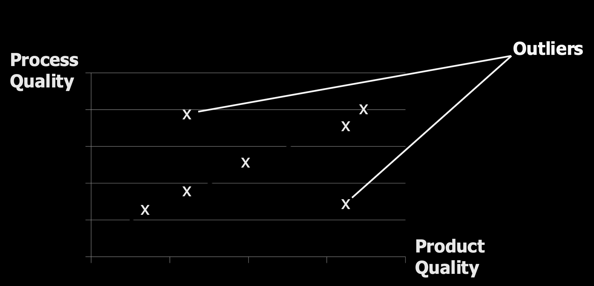

### Modeling and Improving the Process

To understand and improve a process, we first need to describe it.

- A Process is the set of activities involved in software development.
- Process Models are abstract representations of these processes. They help us visualize and understand the activities and the information flow between them. These models do not need to be overly formal or completely detailed to be useful.

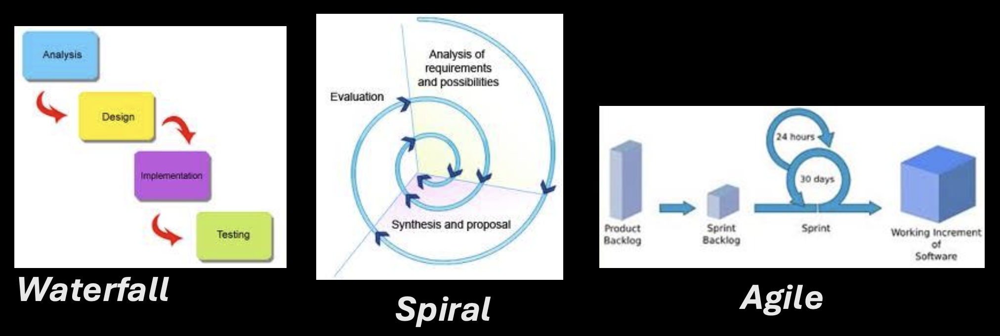

### The Need for Customization and Continuous Improvement

A key insight is that no single, ideal, or standard process exists that fits all situations. The right process depends on:

- The organization's size and culture.
- The background and skills of the staff.
- The type of software product being built.
- Specific customer or market requirements.

Therefore, processes must be customized and are always candidates for improvement.

### What to Improve and How to Improve It

The improvement effort should target process activities that influence product quality. Examples include:

- Core activities like Testing and Reviews.
- Support activities like Version control and maintenance.
- The process itself, measured by attributes like development time or project visibility.

The cycle for process improvement follows a systematic approach:

1. **Measure**: Monitor key attributes of the current process (e.g., defect rates, cycle time).
2. **Analyze**: Evaluate the measurements to identify bottlenecks, weaknesses, or inefficiencies.
3. **Change**: Based on the analysis, identify and apply the necessary changes to the process.

This Measure-Analyze-Change cycle is a cornerstone of both traditional process improvement (like CMMI) and Agile's emphasis on adaptation and retrospectives.

### Process Measurement: The Foundation of Control

To improve a process, you must first understand it quantitatively. This is the principle behind process measurement.

- It involves measuring the process itself, the products it creates, and the resources it uses (like time and people).
- The adage "You can't control what you can't measure" underscores its importance. Without quantitative data, improvement is based on guesswork.
- To collect meaningful data, the process must be clearly defined beforehand. You need to know what you are measuring.

```
+----------------------------------+
|                Constraints       |
|                     |            |
|                     v            |
|               +-----------+      |
|   Goals ----> |  Product  |      |
|               +-----------+      |
|                   ^   |          |
|      Measurement  |   | Action   |
|                   |   v          |
+----------------------------------+

             +-----------+       +-----------+
Needs ---->  |  Process  |       |  Product  |
             +-----------+       +-----------+
               ^     |                 |
               |     |                 |
               |     +-----------------+
           Resources     Measurement
```

### Process Analysis and Change: The Improvement Cycle

Once measurements are collected, the next steps are analysis and change. This involves:

- Improvement identification and prioritization: Deciding which process problems are most important to fix.
- Introducing changes, which can be of different types:
  - Adopting new practices, methods, or processes (e.g., introducing daily stand-up meetings).
  - (Re)ordering of activities (e.g., writing tests before code).
  - Adding or removing deliverables (e.g., reducing mandatory documentation).
  - Adding or removing roles and responsibilities (e.g., creating a dedicated Scrum Master role).
- Training and tuning: Ensuring the team understands the changes and refining them based on initial results.

### Overview of Software Development Approaches

The course focuses on three primary approaches to structuring the software development process:

1. **Waterfall Approach**: A traditional, plan-driven method.
2. **Spiral Development**: An incremental, risk-driven approach.
3. **Agile Software Development**: An iterative, flexible, and collaborative approach (the main focus of this course).

### The Waterfall Approach: A Plan-Driven Cascade

The Waterfall model is characterized by:

```
+----------+          +--------+          +----------------+          +---------+
| Analysis |  ----->  | Design |  ----->  | Implementation |  ----->  | Testing |
+----------+          +--------+          +----------------+          +---------+
```

- Being derived from system engineering processes and is plan-driven.
- All activities are scheduled beforehand in separated, cascaded phases that flow one into the next, like a waterfall.
- Each phase (e.g., Requirements Analysis, Design, Implementation, Testing, Maintenance) produces specific documentation as its primary output before the next phase begins.
- The process is made visible and manageable through this documentation. It is applicable if requirements are well understood and unlikely to change radically.
- Iteration (going back to a previous phase) is possible but is typically seen as a costly exception for fixing errors or handling change requests.

```
       Requirements            Architecture
      specification,              design,                Source               Unit/System
      use case model          detailed design             code                 test docs
             |                      |                      |                      |
    +-----------------+       +------------+       +----------------+        +-----------+       +-------------+
    |  Requirements   |-----> |   Design   |-----> | Implementation |----->  |  Testing  |-----> | Maintenance |
    |    analysis     |       |            |       |                |        |           |       |             |
    +-----------------+       +------------+       +----------------+        +-----------+       +-------------+
             ▲                      ▲                       ▲                      ▲                     ▲
             │                      │                       │                      │                     │
             +----------------------+-----------------------+----------------------+---------------------+
                                           (Faults, change requests)
```

### Spiral Development: An Incremental, Prototype-Based Approach

Spiral Development addresses some Waterfall limitations by being incremental.

- It involves interleaved specification, development, and validation activities, not strictly sequential phases.
- It emphasizes feedback across activities.
- The core of the approach is the development and evaluation of a series of prototypes or increments, with each cycle (spiral) building upon the previous one.

### Advantages and Disadvantages of Spiral Development

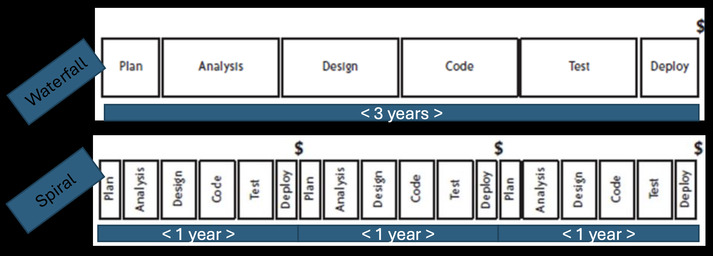

+/ Well-suited for uncertain or changing requirements because feedback is gathered early from each prototype.
–/ Requires a stable software architecture from early on to support the incremental builds.
+/ Suitable for large projects with long development cycles (e.g., releasing a new major prototype every year).

> **Important Note**: Agile software development suggests even shorter development cycles and more rapid feedback than the traditional Spiral model.

### The Motivation for Agile Software Development

The key motivation is the reality of incomplete, imprecise, uncertain, and changing requirements.

- Traditional "plan-driven" approaches (like pure Waterfall) fall short in a fast-moving business environment where change is constant.
- While a complete, up-front analysis (as used in safety-critical systems) has its place, it has drawbacks for general commercial software:
  - It assumes you can define a complete set of requirements at the start, which is often impossible.
  - It is therefore unsuitable for rapid software development where learning and adaptation are needed.

### The Solution Approach

The final slide, "Solution Approach," is left blank, serving as a conceptual bridge. The implied solution to the problems of rigid, plan-driven methods is Agile Software Development itself. Agile provides the framework for embracing change, delivering value frequently, and improving the process continuously through short cycles and tight feedback loops—directly addressing the motivations listed.

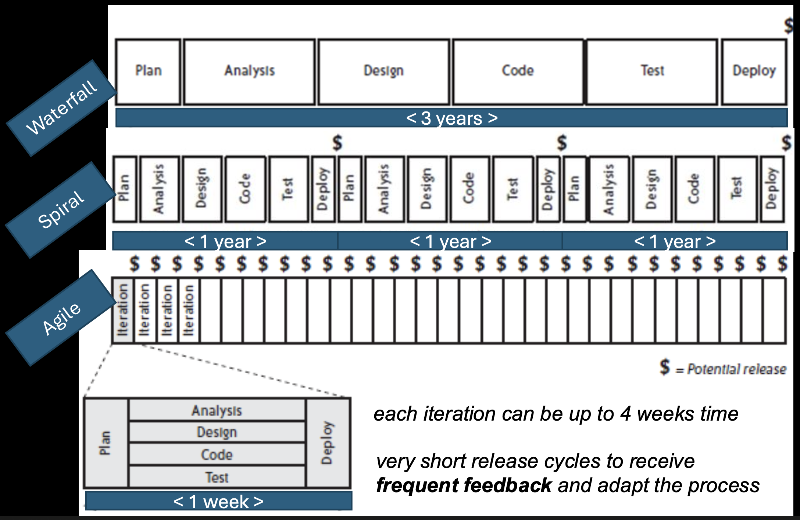

## Agile Software Development, Success, and the Manifesto

### Redefining Project Success

Traditionally, a successful project was defined by being on time, on budget, and fulfilling the specification. However, Agile encourages us to look beyond deadlines and budgets to deeper, more meaningful dimensions of success:

- **Personal Rewards**: Team satisfaction, learning, and growth.
- **Technical Excellence**: Building software well.
- **Elegant, Maintainable Code**: Creating an asset, not just a deliverable.
- **Delivering Value**: The ultimate goal for the customer.

Success has multiple dimensions:

- Organizational Success
- Technical Success
- Personal Success

A truly successful project delivers value across all these dimensions.

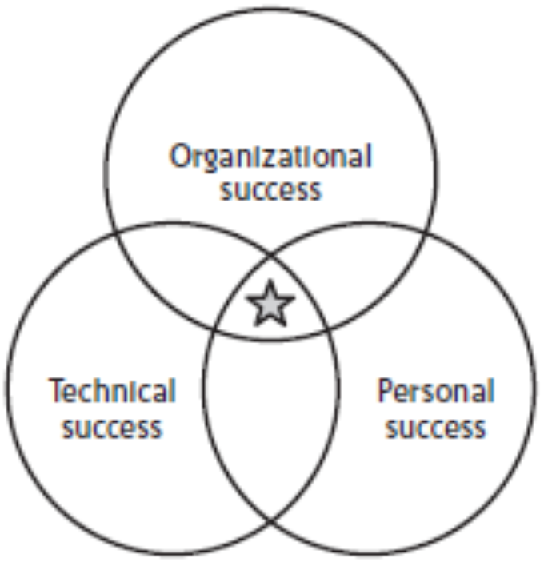

### Organizational Success

This focuses on business outcomes and efficiency:

- Focusing on delivering value to the customer and the business.
- Releasing the most valuable features first and releasing frequently to get feedback and ROI early.
- Being able to change direction to match business needs as they evolve.
- Reducing costs by eliminating waste and inefficiency.
- Achieving technical excellence to ensure long-term sustainability.
- Setting expectations early and maintaining fast communication and steady progress.

### Technical Success

This focuses on the quality and sustainability of the software product itself. Key practices that lead to technical success include:

- **Pair Programming**: Ensures at least two people review every part of the code, improving quality and spreading knowledge.
- **Continuous Integration**: Frequently integrating code to detect problems early.
- Finishing each feature completely before starting the next (the "Definition of Done").
- **Test-Driven Development (TDD)**: Writing tests before code to drive simple, evolvable designs.
- Maintaining simple, evolvable designs that are easy to change.

### Personal Success

This focuses on the human element—the satisfaction and growth of the team:

- The pride in delivery of useful and valuable software.
- Improved technical quality of their work.
- Team autonomy and the ability to self-manage.
- Achieving stakeholder satisfaction through collaboration.

### Changing the Game: A New Way of Working

Agile represents a fundamental shift—developing and delivering software in a new way. This new approach:

- Requires consistency and rigorousness in applying its practices; it is not a loose or undisciplined method.
- Aims to ship valuable software and demonstrate progress on a regular basis (e.g., every iteration).

### What are Agile Methods?

- A method or process is simply a way of working.
- Agile Methods (like Extreme Programming and Scrum) are specific processes that support the agile philosophy.
- These methods consist of individual elements called practices. Examples of practices include:
  - Using version control
  - Setting coding standards
  - Holding weekly demos

### The Core: The Agile Manifesto and Its Principles

The Agile Manifesto is the foundational document. It states that while there is value in the items on the right, we give more value to the items on the left:

1. Individuals and interactions over processes and tools
2. Working software over comprehensive documentation
3. Customer collaboration over contract negotiation
4. Responding to change over following a plan

### The Twelve Basic Principles

The Manifesto is supported by twelve principles. Your slides highlight the following key subset:

**Principles related to delivery and customer focus:**

- Our highest priority is to satisfy the customer through early and continuous delivery of valuable software. (Focus on value and customer satisfaction).
- Welcome changing requirements, even late in development. Agile processes harness change for the customer's competitive advantage.
- Deliver working software frequently, from a couple of weeks to a couple of months, with a preference to the shorter timescale.
- Business people and developers must work together daily throughout the project.
- Build projects around motivated individuals. Give them the environment and support they need, and trust them to get the job done.
- The most efficient and effective method of conveying information is face-to-face conversation.
- Working software is the primary measure of progress.

**Principles related to team, technical, and process excellence:**

- Agile processes promote sustainable development. The sponsors, developers, and users should be able to maintain a constant pace indefinitely.
- Continuous attention to technical excellence and good design enhances agility.
- Simplicity—the art of maximizing the amount of work not done—is essential.
- The best architectures, requirements, and designs emerge from self-organizing teams.
- At regular intervals, the team reflects on how to become more effective, then tunes and adjusts its behavior accordingly.

### Common Philosophies and Approaches

The final slide serves as a heading, indicating that the various Agile methods (Scrum, XP, etc.) all share these **common philosophies and approaches** rooted in the Manifesto and its principles. They represent different implementations of the same core values.

## Scrum

### What is Scrum?

Scrum is one of the most popular Agile methods. It is specifically designed for dealing with uncertainty and complexity in product development. Its foundation is Empirical Process Control theory, meaning it is based on observation, inspection, and adaptation rather than detailed upfront planning. A key benefit is that it provides high visibility into the project's progress and health.

### Empirical Process Control: The Scrum Foundation

Empirical Process Control is about guiding a process step by step, learning from each step, and converging to an acceptable solution. It is built on three pillars:

- **Visibility**: All aspects of the process must be visible to those responsible for the outcome.
- **Inspection**: The artifacts and progress toward the goal must be inspected frequently.
- **Adaptation**: If inspection reveals the process is deviating or the outcome is unacceptable, adjustments must be made immediately.

Scrum implements this through a 24-hour inspection cycle (the Daily Scrum) and a regular, iterative cadence.

### Scrum Overview: The Basic Cycle

Scrum is an iterative and incremental framework.

- It features a daily inspection of activities (the Daily Scrum).
- The project is broken into fixed-length cycles called Sprints (or Iterations).
- This cycle continues until the project is no longer funded or the goal is achieved.

### The Scrum Steps in an Iteration (Sprint)

Each Sprint follows a pattern:

- Review requirements from the prioritized backlog.
- Select a shippable functionality (a set of backlog items) to commit to for the Sprint.
- The team makes its best effort during the iteration to complete that functionality.
- At the end, there is an inspection of the functionality by stakeholders (the Sprint Review).
- Based on the inspection, the team makes timely adaptations to the product (backlog updates) and process (in the Sprint Retrospective).

During an iteration, the team figures out what needs to be done and selects the best way to do it, repeatedly.

- They evaluate requirements, available technology, skills, and capabilities and collectively determine what and how to build.
- They modify their approach daily based on emerging complexities, difficulties, and surprises.

### The Three Core Scrum Roles

Scrum defines three specific roles with distinct responsibilities:

#### A. The Product Owner:

- Responsible for clarifying requirements and defining release plans.
- Ensures that the most valuable functionality is produced first.
- Manages the Product Backlog, which is the list of frequently prioritized requirements.

#### B. The Team:

- A self-managing, self-organizing, and cross-functional group of professionals.
- They decide how to turn the Product Backlog items into a potentially shippable product increment. No one tells the team how to do their work.

#### C. The ScrumMaster:

- This is not a traditional project manager.
- The ScrumMaster is a servant-leader for the team, responsible for:
  - Making sure that all decisions, problems, and progress are visible to everyone.
  - Ensuring that the team follows the Scrum rules and practices.
  - Preventing external interrupts from disrupting the team during a Sprint.

Distinction: The slides mention the classic "pigs and chickens" metaphor. The "pigs" (the Product Owner, ScrumMaster, and Team) are fully committed and accountable for the project's success. The "chickens" (stakeholders, managers, customers) are involved but not accountable for delivery.

### Scrum Ceremonies (Meetings)

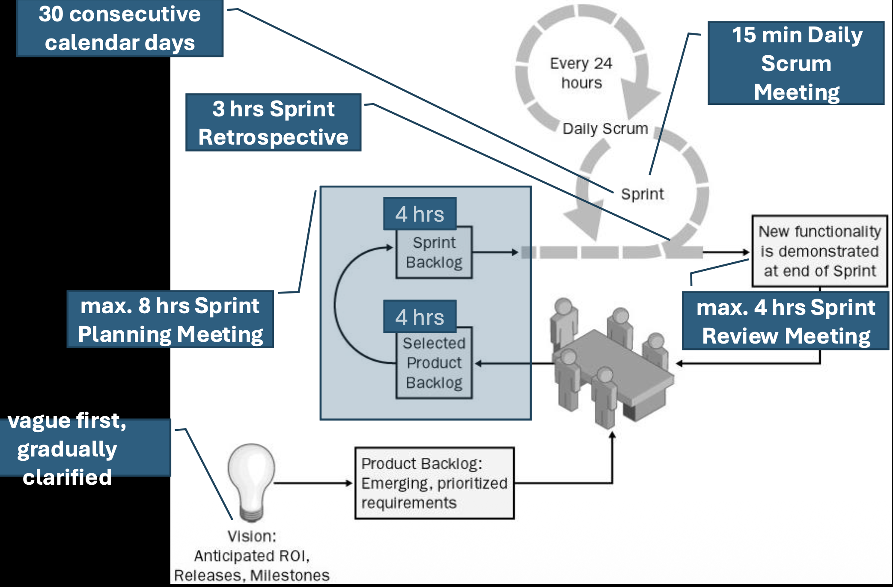

Scrum replaces extensive documentation with frequent, structured communication through meetings. These are the core empirical inspection and adaptation points:

- **Sprint Planning Meeting**: At the start of a Sprint. The product owner and the team discuss and select the most valuable and releasable functionality to focus on for the upcoming Sprint.
- **Daily Scrum**: A 15-minute daily meeting for the Team (and ScrumMaster) to synchronize by discussing progress, plans for the day, and any impediments.
- **Sprint Review**: Held at the end of the Sprint. The team presents the results (the working increment) to the stakeholders for feedback.
- **Sprint Retrospective**: Also held after the Sprint. The team meets to revise their development process, discussing what went well and what could be improved for the next Sprint.

The philosophy is more meetings, less documentation, with the meetings ensuring alignment, transparency, and rapid adaptation.

## Scrum Artifacts – Product Backlog, Sprint Backlog, and Burndown Chart

### The Product Backlog: The "What"

The Product Backlog is the single, authoritative source for everything that might be needed in the product. It is a dynamic, prioritized list of features, functions, enhancements, and fixes.

- **Ownership**: The Product Owner is solely responsible for the backlog's contents, prioritization, and availability. The team may help with estimation, but the PO owns the "what" and "why."
- **Nature**: It is a dynamic, evolving, and never complete list. As the product and market change, new items are added, and priorities are re-ordered.
- **Content**: Each item (often called a Product Backlog Item or PBI) should have a description and an initial estimate (often in relative units like story points) to aid in planning. The table in the slide shows a backlog with items like "Create product backlog worksheet" and their estimates.
- **Visualization**: It is often maintained in a tool (like the worksheet shown) that allows for easy viewing and updating of priorities.

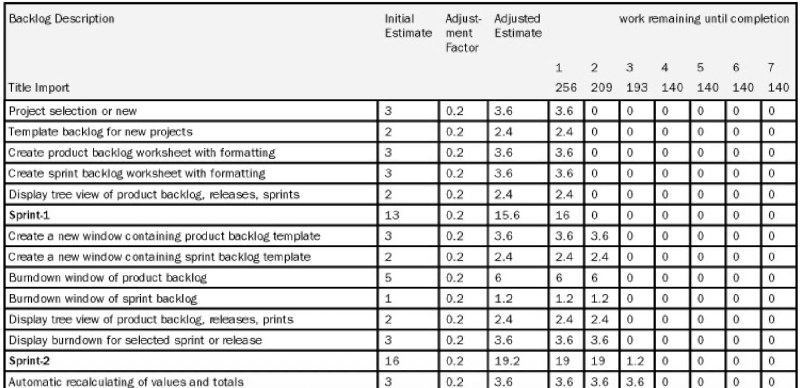

### The Sprint Backlog: The "How" for the Current Sprint

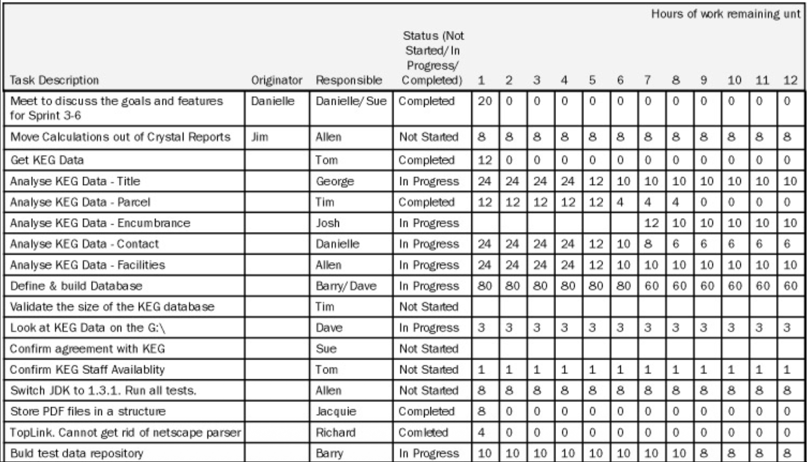

The Sprint Backlog is the set of Product Backlog items selected for the current Sprint, plus a plan for delivering them. It is a real-time picture of the work the Team plans to accomplish during the Sprint.

- **Creation**: It is composed at the second part of the Sprint Planning Meeting. In the first part, the what is decided (which PBIs to do). In the second part, the team figures out the how and breaks those PBIs down into tasks.
- **Content**: It defines the tasks for completing the selected functionality. The slide's table is a classic Sprint Backlog example. It lists tasks (e.g., "Analyze KEG Data - Title"), their originator, the responsible team member, and their status (Not Started, In Progress, Completed).
- **Task Granularity**: A good rule is that each task should take 4 to 16 hours to finish. This makes progress easy to track daily.
- **Ownership & Visibility**: The Sprint Backlog can be modified only by the Team as they learn more during the Sprint. It must be highly visible, typically displayed on a physical or digital task board.

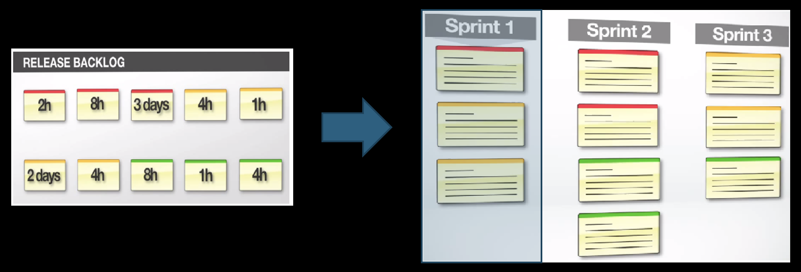

### The Increment: The "Done" Result

The goal of each Sprint is to produce an Increment of potentially shippable product functionality.

- This means the work is "Done" according to a shared team definition, which usually includes being thoroughly tested, well-structured, well-written, and documented (e.g., with usage in help files).
- Each Increment adds to all previous Increments and must be in a working, integrated state.

### The Burndown Chart: Tracking Progress Visually

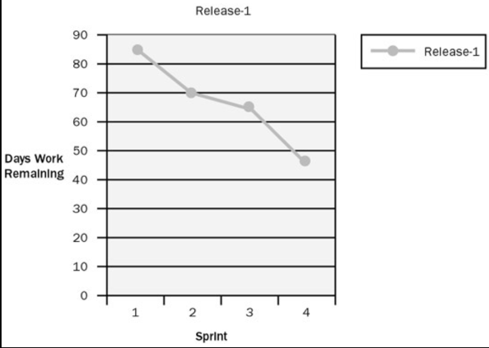

The Burndown Chart is a simple, powerful tool for visualizing progress vs. work to be done.

- Purpose: It shows the amount of work remaining across time. The ideal trend is a line that "burns down" to zero by the end of the Sprint.
- How it works:
  - The vertical axis represents the Total Work Remaining (usually in hours of task effort, as shown in the slide's example starting at 38h).
  - The horizontal axis represents time (the days of the Sprint).
  - Each day, the team updates the chart by summing the remaining effort on all unfinished tasks. If they completed 4 hours of work, the line goes down by 4. If they discover new work, the line may go up.

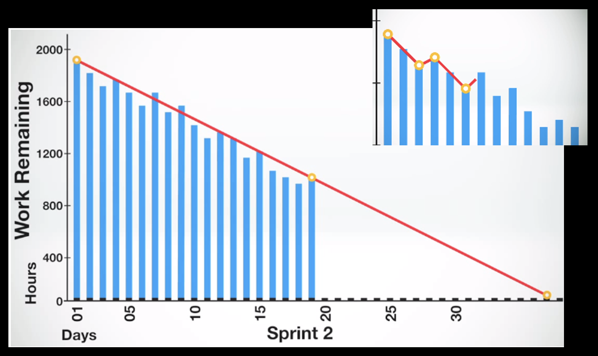

> **Example**: The text "2h 4h 2 days 4h 8h 4h Total Work Remaining: 38h 44h Day 2" suggests a scenario: perhaps on Day 2, the team finished 6 hours of work (2h+4h), but also added or discovered 12 new hours of work, causing the total remaining to increase from 38h to 44h. This makes impediments and scope change immediately visible.

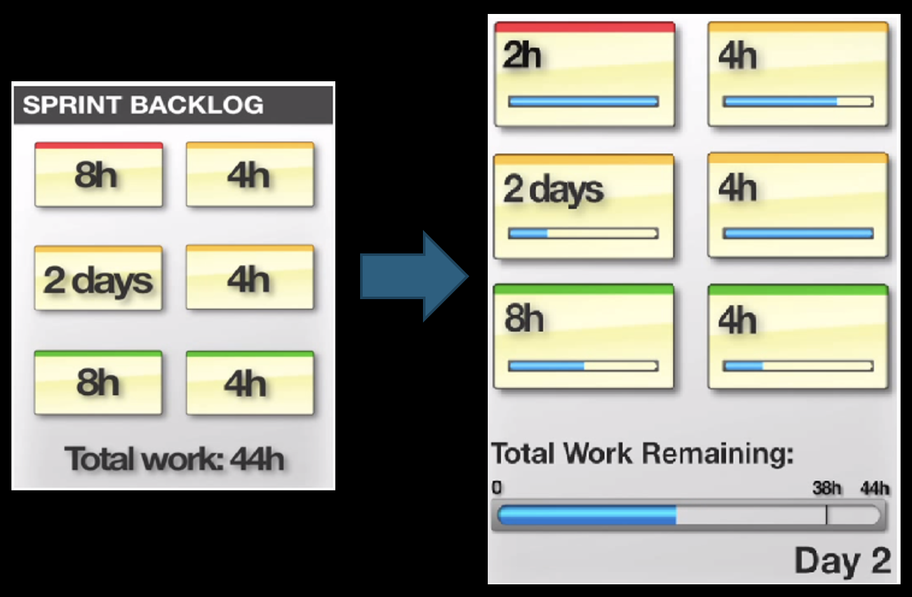

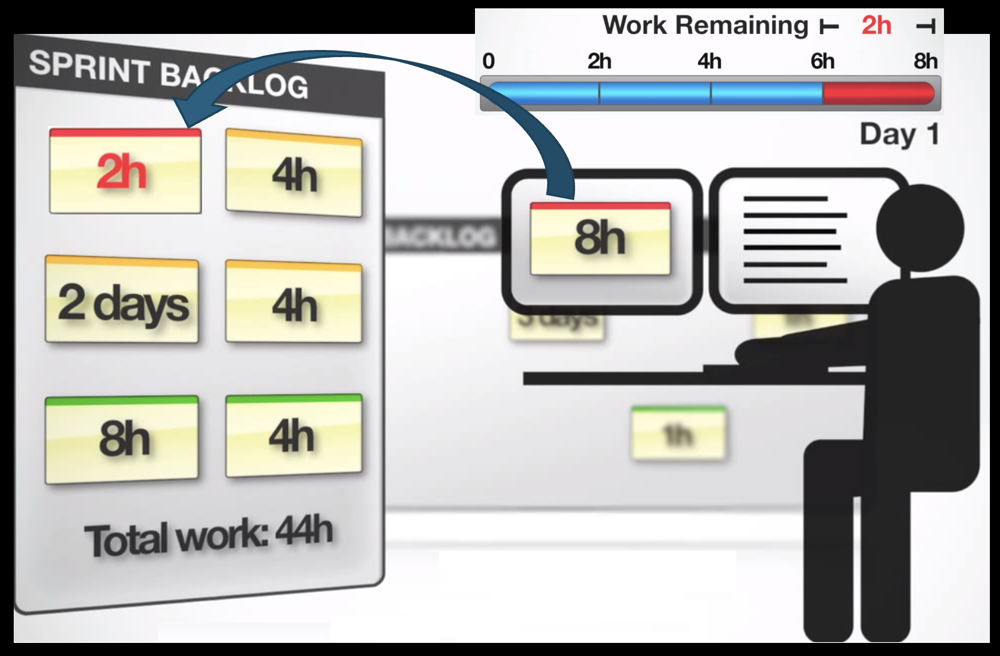

## Advanced Scrum Concepts and Ceremonies

### Scaling and Adaptation: Scrum of Scrums

When multiple Scrum Teams work on a single, large product, a Scrum of Scrums meeting is used to coordinate.

- It is designed for heavily interdependent teams.
- Each team sends a part-time shared member (often a representative or the ScrumMaster) to this meeting. This person is responsible for keeping track of the big picture and influencing every team.
- The rationale is that a pure implementation of Scrum within each team is not always enough for complex projects. Since Scrum is based on empirical control theory, it states: as the degree of complexity rises, the number of inspections must be increased. The Scrum of Scrums is an additional inspection point. As the frequency of inspections increases, the opportunity for adaptation also increases.

### The Core Strengths of Scrum

#### A. The Power of Timebox:

The fixed-length Sprint (timebox) creates focus and reduces complexity.

- It forces a focus on what is possible within a limited time.
- It encourages team collaboration to solve a real problem.
- It aids in reducing complexity by breaking down problems into manageable chunks.
- It becomes the art of what is possible.

#### B. The Power of Communication:

Scrum maximizes communication through structured and informal channels.

- Daily Scrums and informal meetings ensure everyone knows about progress and problems.
- This open communication means people might know solutions for problems of others, fostering collective problem-solving.

#### C. Customer Collaboration:

Scrum directly addresses a common failure of traditional methods.

- Claim 1: Introducing many formal software engineering practices can widen the gap between stakeholders and developers.
- Claim 2: Heavy reliance on documentation replaced face-to-face communication.
- The Scrum solution: The team and the Product Owner have to communicate frequently. Furthermore, the team should talk in terms of business needs and objectives, not just technical details.

### Terminology and the Sprint Planning Meeting

The use of terms is not so important; what matters is the essence. A Product Backlog is just a prioritized list of requirements, and a Sprint is just a period (e.g., one month) between meetings.

The Sprint Planning Meeting is an 8-hour, timeboxed event that kicks off the Sprint.

- **First 4 hours**: The Product Owner and Team collaborate on selecting Product Backlog items for the Sprint. The Product Owner must prepare the Product Backlog before the meeting.
- **Second 4 hours**: The Team alone prepares the Sprint Backlog. They break down the selected PBIs into tasks, create task estimates, and make assignments. The goal is to make the plan complete enough for a confident commitment.
- **Outcome**: A set of selected Product Backlog items committed by the team to be turned into an increment of shippable functionality.
- **Clarification**: The Product Owner takes part in the second part just to clarify Product Backlog items further, if necessary.
- **Embracing Uncertainty**: The timebox is strict although the Product Backlog items and the time estimates are imprecise. The team accepts that the rest must be resolved during the Sprint through daily adaptation.

### The Daily Scrum: The 15-Minute Sync

A strict **15-minute** meeting held at the same place and same time every day. Everybody on the Team must attend promptly.

- **Format**: Each team member answers just three questions:
  1. What have I done for the project since the last daily scrum meeting?
  2. What will I do until the next daily scrum meeting?
  3. What impedes me from performing my work as effectively as possible?
- **Rules**: One person at a time, discussion is kept in the scope of the three questions, and nobody outside the team interferes.

### The Sprint: Rules and "Done"

A Sprint is 30 calendar days (or less). During the Sprint:

- The Team can seek outside advice, help, and information.
- The Product Backlog is frozen (i.e., no new goals are added by the PO mid-Sprint).
- Team responsibilities include: attending Daily Scrums and keeping the Sprint Backlog up-to-date and visible to everyone (e.g., updating day-to-day estimated hours for each task).
- Problems: The ScrumMaster can abnormally terminate the Sprint if it becomes non-viable due to major business/technological changes or severe interference.

#### Definition of "Done":

For an increment to be considered "Done," it must be more than just coded. The slide's checklist includes:

- Feature complete
- Code complete
- Approved by the Product Owner
- No known defects
- Production Ready

### The Sprint Review: Inspecting the Product

A 4-hour meeting at the end of the Sprint.

- **Preparation**: At most 1 hour for preparation.
- **Content**: The team should present no artifacts, only functionality that is ‘done’. They discuss initial plans, what went well, and what did not.
- **Interaction**: There is an Answers & Questions session with stakeholders to get their impressions and desires.
- **Outcome**: This leads to a reconsideration of the Product Backlog and its prioritization for future Sprints.
- **Facilitation**: The ScrumMaster organizes the meeting.

### The Sprint Retrospective: Inspecting the Process

A 3-hour meeting for the Team, the ScrumMaster, and the Product Owner after the Sprint Review.

- The team reflects: What went well, what did not?
- The Team prioritizes possible improvements to their process.
- The ScrumMaster is responsible for the arrangements.
- Actionable items from the retrospective can be formulated as high-priority non-functional Product Backlog items for the next Sprint, ensuring process improvements are acted upon.

## Scrum Principles, Artifacts, and Metrics

### The Scrum Lifecycle (Big Picture)

The Scrum Lifecycle is a structured process designed to deliver value quickly and reliably. At the center of this cycle is the Iteration (also known as a Sprint), which is a time-boxed period of work typically lasting 2 to 4 weeks.

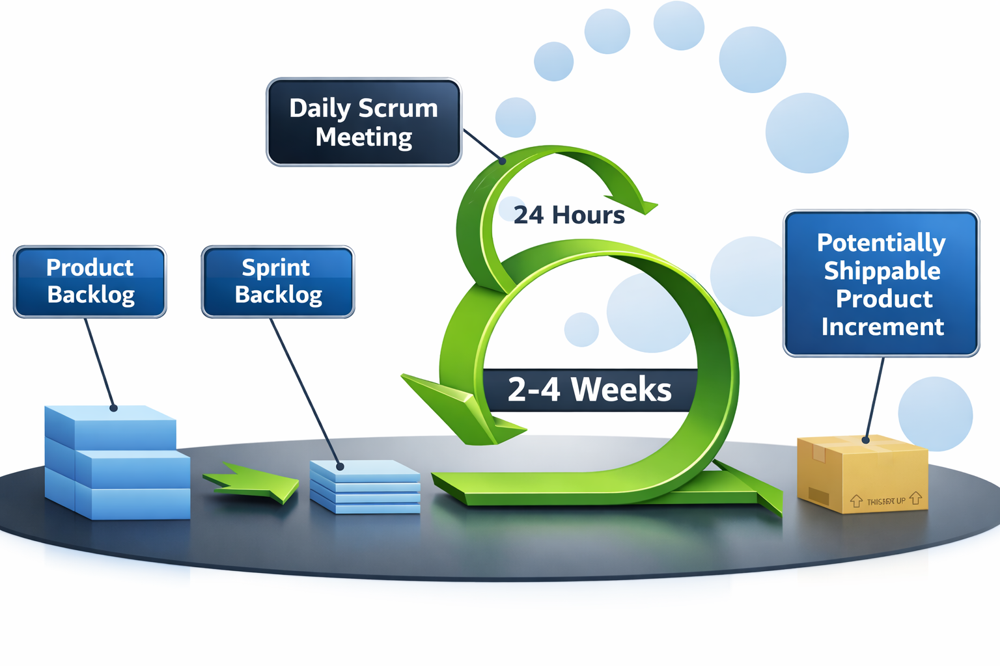

Key components of this lifecycle include:

- Backlog Management: Work begins with the Product Backlog, from which specific items are selected to create the Sprint Backlog for the current iteration.
- Daily Synchronization: Every 24 hours, the team holds a Daily Scrum Meeting to coordinate their efforts.  
- Outcome: The goal of every iteration is to produce a Potentially Shippable Product Increment—a functional piece of software that provides immediate value.

### Core Terminology and Hierarchy

- Understanding the specific terminology used in Scrum is essential for effective project management:
- Product: The piece of software being developed under the company.
- Project: Refers to the major releases of the product.
- Backlog: A comprehensive list of stories and tasks associated with an entity.
- Iteration (Sprint): A time-boxed work period, often on a weekly or bi-weekly basis.
- Typical Product Hierarchy: In practice, a New Product is broken down into multiple Releases (e.g., Release 1, Release 2), each containing a series of Sprints (e.g., Sprints 1–4) .

### Understanding Backlogs, Stories, and Tasks

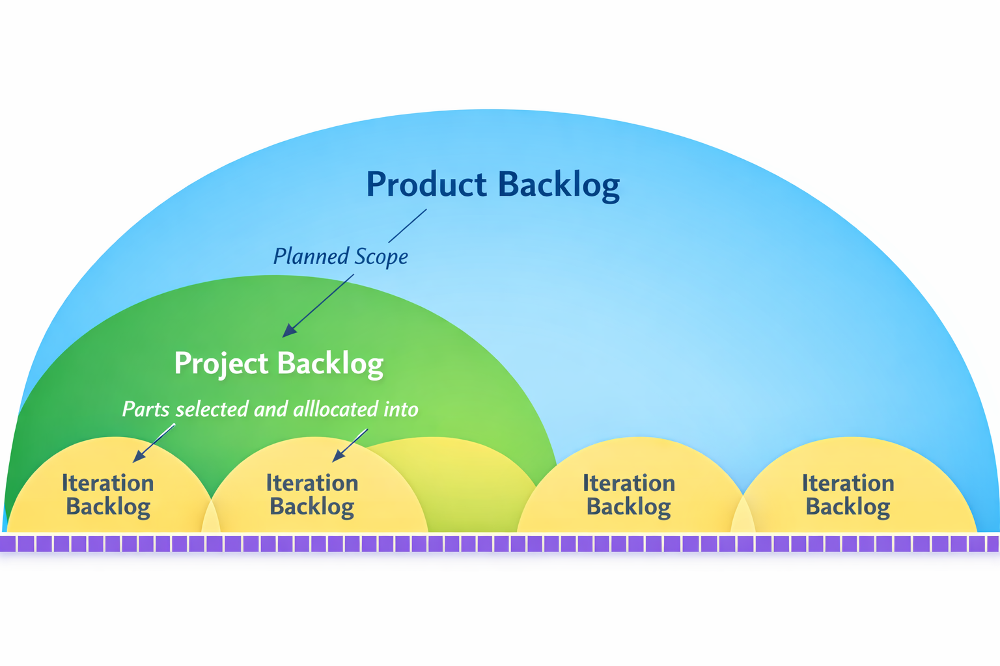

Scrum organizes work through a clear hierarchy of items that represent different levels of detail and value:

- **Product Backlog:** Represents the entire planned scope of the product.
- **Project Backlog:** Contains parts of the product backlog chosen and allocated for a specific major release.
- **Iteration Backlog:** The most granular level, containing the specific work allocated for a single sprint.

### Typical Product Hierarchy

The work in Scrum is often structured in a Typical Product Hierarchy. This hierarchy helps break down large, complex pieces of work into manageable units. It typically flows from large themes or epics, down to smaller stories (descriptions of desired functionality from a user's perspective), and further into specific tasks.

### Tracking Progress: Burn-up and Burn-down Charts

Two primary charts are used to visualize progress and ensure the team is on track:

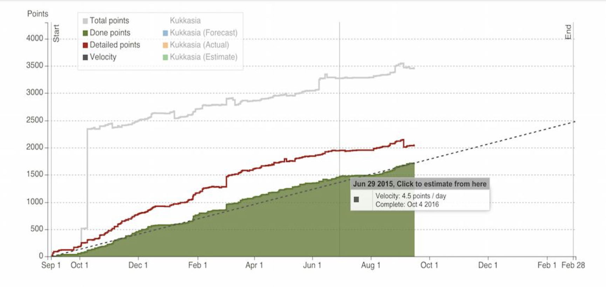

- **Project Burn-up:** This chart tracks the overall progress of the project in terms of story points. It visually depicts the accumulation of completed story points (the "Done" area, often in green) plotted against the total scope of the project over time. It shows how much work has been completed and how the total scope may change.

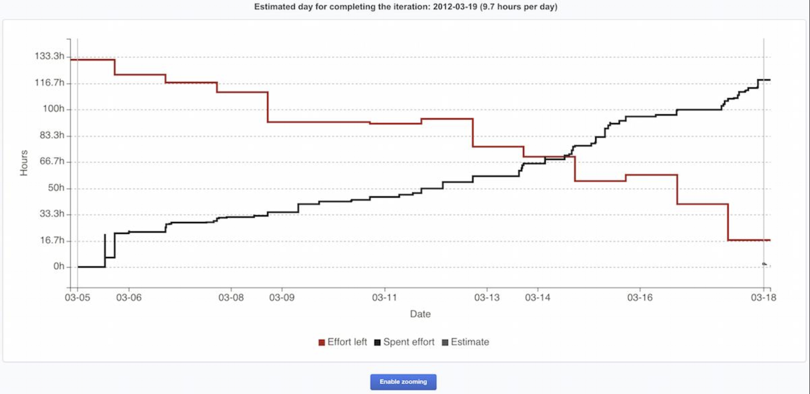

- **Iteration Burn-down:** This chart tracks the progress of tasks within a single iteration (Sprint) as a function of time. It typically shows the amount of work remaining (often in hours) on the vertical axis against the days of the Sprint on the horizontal axis. The ideal trend is a downward slope to zero, showing the team "burning down" their remaining work.

### Distinguishing Stories and Tasks

In a typical use case, stories are clearly separated from tasks.

- Stories represent units of customer or user value. They describe what needs to be built and why, from a user's perspective. A story has value when completed (e.g., "As a user, I can log in so I can access my account").
- Tasks are the concrete, technical steps required to implement a story. They describe how the work will be done. Tasks might not have direct user value on their own (e.g., "Design login UI mockup," "Set up authentication API endpoint").

> This separation enables prioritization to be done at the story level (based on business value), while tasks are added to a story for detailed planning and tracking of the activities needed to complete it. A story can contain one or more tasks.

### Estimating Stories and Tasks

Effort estimation is applied differently to stories and tasks:

- Stories are typically estimated in story points, which are relative units of size/complexity.
- Tasks are estimated in man-hours, representing a more concrete effort forecast. A key metric for tasks is Effort Left, which is the team's current estimate of the work still required to complete the task.

### Story and Task States

Stories (and tasks) move through a series of pre-defined states during their lifecycle. These states provide clarity on the current status of any work item:

- **Not Started:** No work has yet been put into realizing this story/task.
- **In Progress:** Work is ongoing and some effort has already been invested.
- **Blocked:** The work cannot proceed. Most likely, some action must be taken by the team ('us') or an external party before work can continue.
- **Pending:** The work is waiting for something external that can reasonably be expected to happen without the team taking any further immediate action.
- **Ready:** The core work is otherwise done, but some relatively minor "definition of done" criteria are yet to be met (e.g., the story must be demoed to the product owner, released to production, or discussed in a stand-up meeting).
  Deferred: The story/task has been decided to be skipped in the current project or iteration. Its effort/points are omitted from all progress metrics. This allows teams to quickly scope out items without moving them to a different backlog.
- **Done:** The final state of a task/story after it has been fully completed according to all criteria. Reaching "Done" affects the project's progress metrics (e.g., burn-up chart).

### Organizing Work with Labels

To improve organization and tracking, stories can be labeled according to various categories such as:

- Bugs (defects to be fixed).
- Usability improvements (enhancements to the user experience).
- New features (new functionality).
- Planned for a specific release.

This labeling system provides a simple issue tracking mechanism within the backlog, allowing teams to filter and manage work by type or purpose easily.

### The Concept of Effort Estimation

A core Agile practice is Effort Estimation, which is the process of evaluating the relative size and complexity of work items. The relative size of stories is estimated in so-called story points. Story points are abstract units that measure effort, complexity, and risk combined, rather than pure time. While story points are common, one can use other measures like person-days for estimation.

### Using an Exponential Scale for Estimation

It is recommended to use an exponential scale when estimating story points. The reason for this is that as the size of a story gets bigger, it becomes increasingly harder to precisely distinguish the difference between N and N-1 points. An exponential scale acknowledges this uncertainty for larger items.

- The Fibonacci Scale: One popular option is to use the Fibonacci scale (1, 2, 3, 5, 8, 13, ...). This non-linear sequence naturally creates larger gaps between numbers as they increase, which aligns with the increasing uncertainty in estimating larger stories.

### Interpreting Story Points

Story points can be loosely associated with timeframes to help teams calibrate their estimates, but this is a guideline, not a direct conversion. For example:

- 1 point: A story that can be done in one sitting without a break.
- 2 points: Requires about a half-day of work.
- 3 points: Requires about a day of work.
- 5 points: Requires about two days.
- 8 points: Requires about a week.

A critical rule is: If a story is estimated to require more than 8 points, it should be broken down into smaller stories. This ensures work items are manageable within a short iteration.
Most importantly: Do not use or map the story points to engineering hours directly! The purpose of story points is to measure relative complexity and enable velocity tracking, not to create fixed time commitments.

### The Estimation Process

The slides outline a general flow for estimation and planning, which can be summarized as:

1. Quick analysis of the story.
2. Reviewing the project or iteration overview.
3. Estimating in terms of story points.
4. Finalizing the effort estimation.

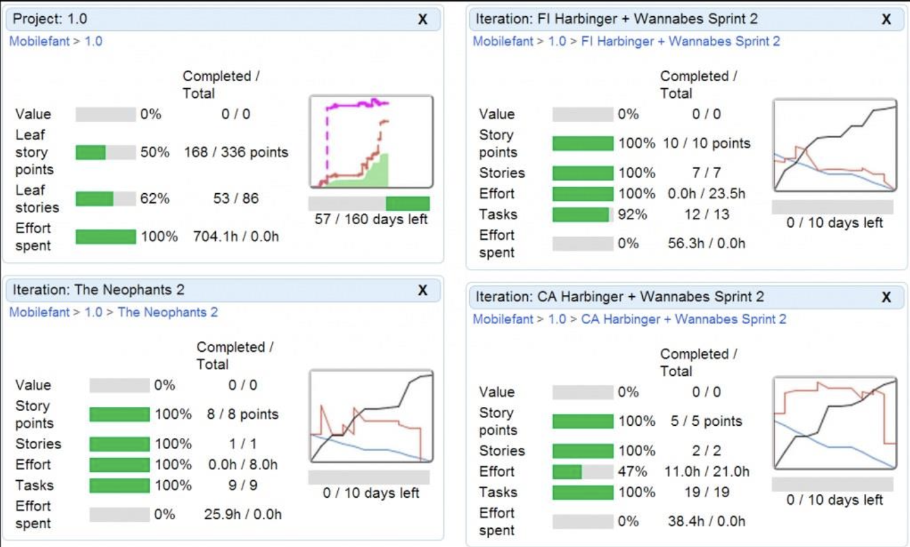

### Jira Issue Categories and Hierarchy

In tools like Jira, work is categorized into a hierarchy that helps manage scope:

- **Stories (User Stories):** Short requirements or requests written from the perspective of an end user. They are the primary unit of work discussed in estimation.
- **Epics:** Large bodies of work that can be broken down into a number of smaller stories. Epics represent significant feature areas or initiatives.
- **Initiatives:** Collections of related epics that drive toward a common, high-level goal.
- **Themes:** Large focus areas that span across the organization, grouping multiple initiatives.

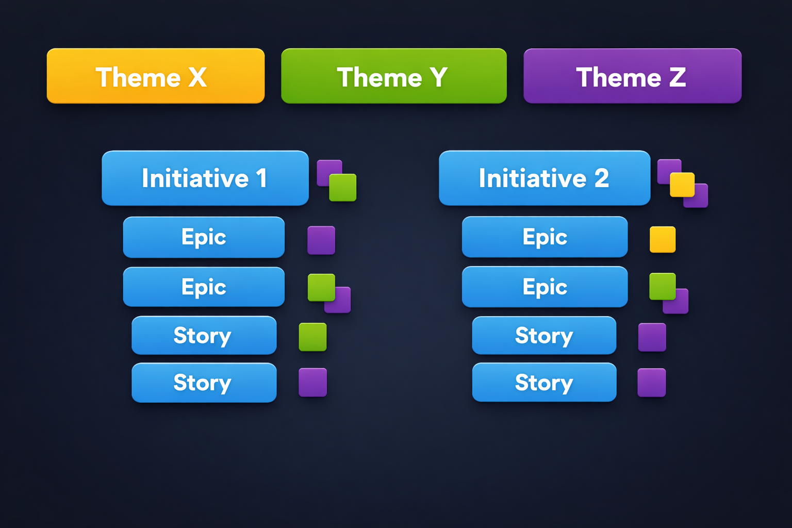

### Jira Examples of Agile Stories

Examples help illustrate what a well-formed story looks like in a real context. For instance, if a company was improving a rocket launch streaming service, stories might be:

- "iPhone users need access to a vertical view of the live feed when using the mobile app."
- "Desktop users need a 'view full screen' button in the lower right-hand corner of the video player."

These examples show stories are user-centric and describe a specific need.

### Comprehensive Jira Issue Statuses

Jira uses a detailed workflow managed through issue statuses. Understanding these states is key for tracking progress in a tool:

- **Open / To Do**: The issue is reported and ready to be worked on.
- **In Progress**: The issue is being actively worked on.
- **In Review / Under Review**: Work is complete and is awaiting or undergoing peer review.
- **Approved**: A reviewer has approved the work.
- **Resolved**: A resolution has been applied, awaiting final verification.
- **Done / Closed**: The issue is considered finished correctly. Closed issues can be reopened.
- **Reopened**: A previously resolved issue was incorrect and needs more work.
- **Rejected**: A reviewer has rejected the completed work.
- **Cancelled**: Work has stopped on the issue.
- **Building / Build Broken**: Statuses related to the integration and build process after code is committed.
- **Backlog / Selected for Development**: Planning statuses indicating the issue is waiting for a future sprint or has been chosen for upcoming work.

## Lean Software Development

### Introduction to Lean Software Development

Lean Software Development is an Agile approach that applies principles from lean manufacturing to the process of creating software. Its core philosophy is to maximize customer value while minimizing waste.

### Defining "Lean"

The term "Lean" describes a production practice that considers the expenditure of resources for any goal other than the creation of value for the end customer to be wasteful. Consequently, any such expenditure becomes a target for elimination.

> Therefore, Lean implementation is focused on getting the right things to the right place at the right time in the right quantity to achieve perfect workflow. This pursuit aims to minimize waste while remaining flexible and able to change. (Source: Wikipedia)

### The Origins of Lean Development

Lean Software Development does not originate in software. It borrows principles from the theory of lean manufacturing, which itself comes from the Japanese manufacturing industry, specifically the Toyota Production System (TPS). Lean Software Development is, therefore, the application of lean principles to software development, involving the translation of widely accepted lean principles into agile practices.

### Historical Context: The Automotive Industry in the 1980s

The power of lean thinking was demonstrated in the late 1980s automotive industry. Consider two competing cars:

- The GM Cutlass took 7 years to go from concept to market.
- The Honda Accord took only 3 years.

> Despite the much shorter development time, the Honda Accord also achieved better quality. This result was counter-intuitive to traditional thinking, which assumed that shorter development time would lead to increased cost and potentially lower quality.

### The Traditional vs. The Japanese (Lean) Approach

| **The Traditional Approach (@ Detroit)**                                                                                                                                                                                                                                         | **The Japanese/Lean Approach (@ Toyota and Honda)**                                                                                                      |
| :------------------------------------------------------------------------------------------------------------------------------------------------------------------------------------------------------------------------------------------------------------------------------- | :------------------------------------------------------------------------------------------------------------------------------------------------------- |
| - Operated on the belief that late changes are extremely costly.<br>- Mandated a sequential development process (like Waterfall).<br>- Adopted a lengthy development cycle to try to get everything right upfront.<br>- Allowed no adaptation in the later stages of production. | - Employed rapid, concurrent development where different phases overlapped.<br>- Designed to accommodate and make changes late in the development cycle. |

### The Core Difference: Managing the Cost of Change

The two approaches were founded on opposite strategies for handling change:

- **Traditional Strategy (Detroit):** The goal was to make the right design decision in the first place to avoid the need to change later on, precisely because changes were believed to be prohibitively expensive during production.
- **Lean Strategy (Toyota/Honda):** The goal was to avoid irreversible design decisions in the first place. Instead, they sought to delay design decisions as much as possible in order to make design decisions with the best available information later in the process.

### Just-In-Time (JIT) Manufacturing

A key lean principle is Just-In-Time Manufacturing, pioneered by Toyota. The idea is: "Don't decide what to manufacture until you have a customer order; then make it as fast as possible." This eliminates waste from overproduction and inventory, tying production directly to demand.

### Beyond Late Decisions: Organizational and Process Differences

The differences extended beyond timing into organizational structure and process:

| Traditional Model                                                                                                       | Lean Model                                                                                                                                                                          |
| ----------------------------------------------------------------------------------------------------------------------- | ----------------------------------------------------------------------------------------------------------------------------------------------------------------------------------- |
| Pushed critical decisions up to a few high-level authorities.                                                           | Emerged decisions from detailed, engineering-level discussions.                                                                                                                     |
| Used sequential processes.                                                                                              | Used concurrent processes; integrating making, testing, and maintenance considerations into the design phase itself.                                                                |
| Resulted in designs subject to modification by both marketing and managers, often far removed from engineering reality. | Was often guided by a single leader who envisioned what the car should be and continually kept the vision in front of the engineers doing the work, ensuring alignment and purpose. |

### Adaptation to Software Development

The success of Lean development was later adapted by many automobile companies in the 1990s and was understood and proven by managers in many other disciplines, including those with design environments as complex as software development. This naturally led to the question: "Why not borrow lean development principles for software development?"

### A Word of Caution: Translation is Key

However, lean principles have not always been successfully applied in new domains. The slides emphasize that:

- The essence of lean thinking must be understood. It's a mindset, not just a set of steps.
- Principles are essential and universal, but practices are applied just to carry out principles.
- There are no "best practices" applicable in all domains.
- Principles must be translated to practices for a particular domain (like software), and this translation is not always easy. A direct copy of manufacturing practices without understanding the underlying principle will likely fail.

### The Seven Core Principles

Lean Software Development is built upon seven fundamental principles that guide its practices and mindset. These principles are a direct translation of lean manufacturing thinking to the software domain:

1. **Eliminate Waste:** The foundational principle. Anything in the development process that does not add value to the product from the customer's perspective should be avoided.
2. **Amplify Learning:** Recognizes that software development is an exercise in discovery. Processes should be designed to maximize feedback and learning through short cycles, testing, and experimentation.
3. **Decide as Late as Possible:** In the face of uncertainty, it is often better to delay decisions until the last responsible moment when the most information is available, allowing for more informed and flexible choices.
4. **Deliver as Fast as Possible:** Short, rapid delivery cycles create more frequent and reliable feedback from customers, which in turn fuels learning and reduces the risk of building the wrong thing.
5. **Empower the Team:** The people doing the work are best positioned to make decisions about it. This principle advocates to let people decide, not the process. Managers should support and enable the team.
6. **Build Integrity In:** The goal is to create products with conceptual and perceived integrity—products that are maintainable, adaptable, and extensible. Quality and good design are not afterthoughts but are built into the process from the start.
7. **See the Whole:** Avoid sub-optimizing individual parts of the system or process at the expense of the overall value stream. Focus on the whole product and process, not getting trapped in local optimizations that create waste elsewhere.

### The Origins in the Toyota Production System (TPS)

These principles originate from the Toyota Production System (TPS), developed in the 1940s. Toyota faced a unique challenge: a need for cheap cars but a market not big enough for mass production economies of scale. This forced them to invent a new way of working for manufacturing, logistics, and product development. The fundamental principle articulated by Taiichi Ohno, the key architect of TPS, was to Eliminate Waste.

### How to See Waste in Software Development

To identify waste, one must critically examine everything in the software development process that is not direct analysis and coding. For each activity, ask:

- Does it really add value for customers?
- Is there a way to do without it?

This approach is inspired by Shigeo Shingo, who identified seven classic types of manufacturing waste.

### Translating the Seven Wastes to Software

The seven manufacturing wastes have direct parallels in software development:

| Manufacturing Waste | Software Development Waste                                             |
| ------------------- | ---------------------------------------------------------------------- |
| Inventory           | Partially done work (e.g., untested code, undelivered features)        |
| Extra Processing    | Extra Processes (e.g., unnecessary documentation, excessive approvals) |
| Overproduction      | Extra Features (features not actually needed by the user)              |
| Transportation      | Task Switching (context switching between different tasks or projects) |
| Waiting             | Waiting (for decisions, approvals, builds, or other team members)      |
| Motion              | Motion (hunting for information, navigating cumbersome tools)          |
| Defects             | Defects (bugs and errors that require rework)                          |

### The Role of Management Activities

In the Lean view, management activities do not directly add customer value, but their proper function is to help in eliminating the wastes listed above. Therefore, complicated project tracking is itself a sign of waste. Effective management should focus on enabling flow by:

- Minimizing the amount of unfinished work in the pipeline (limiting Work-in-Progress).
- Helping teams prioritize and release work as soon as possible to get feedback and deliver value.

### Identifying Waste with Value Stream Mapping

A key tool for implementing the "See the Whole" and "Eliminate Waste" principles is Value Stream Mapping. This involves analyzing the entire process end-to-end, from a customer request until the final release of the product or feature. The central question this mapping seeks to answer is: "How much time and effort is actually spent on adding value to the product, versus time spent on waiting, moving, or reworking?"

### A Manufacturing Example: The Cola Can

A classic example illustrates the staggering amount of waste that can exist in a process. For a cola can:

- Total lead time from raw material to store shelf: 319 days (about 10 and a half months).
- Time where value is actually being added (e.g., shaping, filling, sealing): Only 3 hours.
- This means value-adding activity constitutes just 0.04% of the total time. The rest (99.96%) is waste—inventory, transportation, waiting, etc.

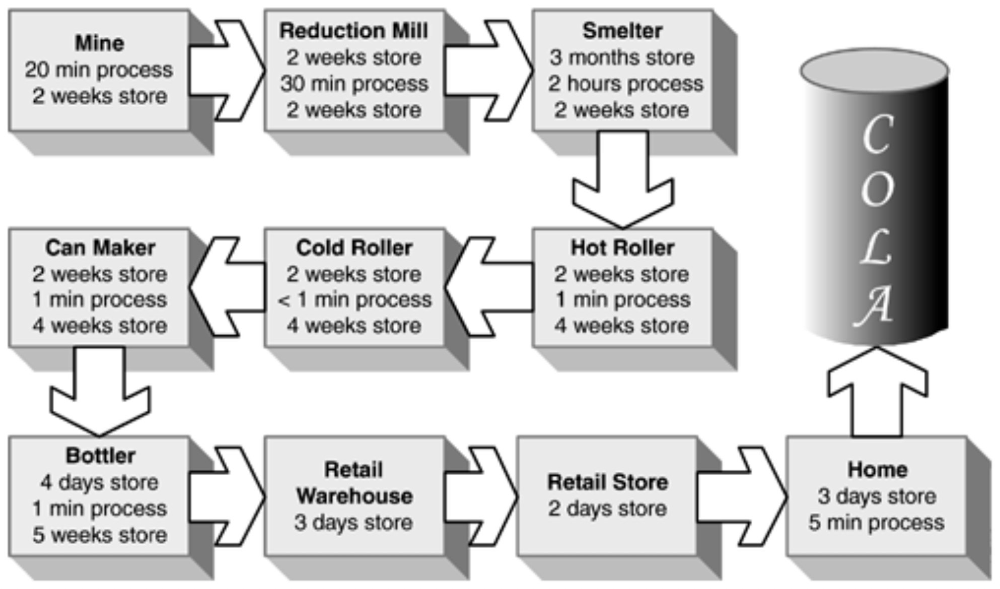

### Value Stream Mapping in Traditional vs. Agile Software Development

The same analysis can be applied to software processes:

**Traditional Software Development Example:** The map might reveal long periods of waiting, such as:

- A project waiting ~6 weeks before starting.
- A design review taking 3 weeks to schedule.
- Coding delayed for 3 weeks due to resource conflicts with other projects.
- 6 weeks allocated for testing and deployment.

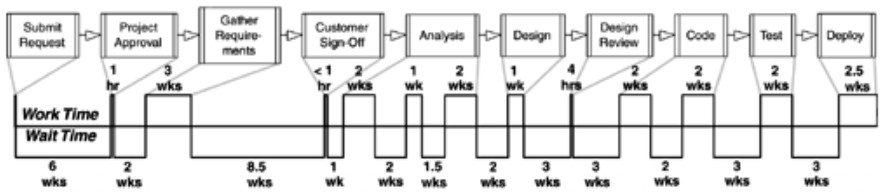

**Agile Software Development:** In contrast, an Agile value stream map would aim to show a much tighter, faster flow with minimal waiting between steps, emphasizing continuous movement of small batches of work from idea to deployment.

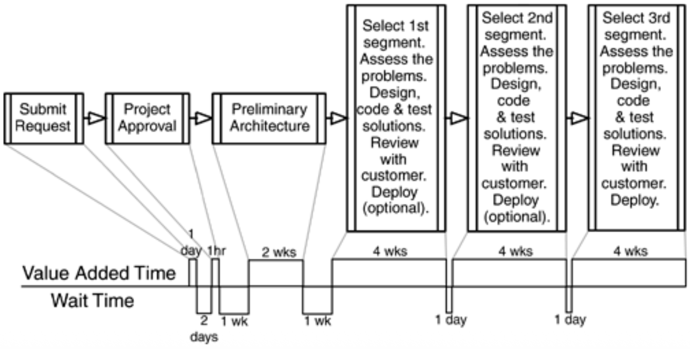

### A Critical Distinction: Development vs. Production

While Lean principles are overall applicable to both, it is crucial to understand that Lean production practices cannot be directly applied to software development. This is because they address two fundamentally different activities:

- Software Development is like designing a recipe. It is a creative, problem-solving, knowledge-generating activity.
- Production (Manufacturing) is like following a recipe to produce a dish. It is a repetitive, predictable, physical execution activity.

### Key Differences Between Development and Production

The slides highlight the opposing characteristics of these two domains:

| Characteristic        | Development (Designing the Recipe)                                                   | Production (Producing the Dish)                                            |
| --------------------- | ------------------------------------------------------------------------------------ | -------------------------------------------------------------------------- |
| Quality Definition    | Quality is "fitness for use." Does it solve the user's problem well?                 | Quality is "conformance to requirements." Does it match the spec?          |
| Variability           | Variable results are good. Experimentation leads to innovation and better solutions. | Variable results are bad. Consistency and predictability are paramount.    |
| The Role of Iteration | Iteration generates value. Each cycle provides learning that improves the design.    | Iteration generates waste (called rework). Going back is a costly mistake. |

### The Nature of Design: Iterative Cycles

Research into how experienced designers work reveals an important truth: when facing ill-defined problems (which have no single right answer or obvious best solution), they do not follow a rigid top-down design process. Instead, they cycle between high-level design and detailed solution exploration. This back-and-forth allows them to learn more about the problem and progressively structure it effectively.

### Applying This to Software Development

Software development is also a problem-solving activity, often dealing with ill-defined requirements and novel challenges. Therefore, effective software development mirrors the designer's approach: Problem solving involves cycles of investigation, experimentation, and checking the results. This iterative, learning-focused cycle is the essence of Agile and Lean Software Development, aligning with the principles of Amplify Learning and Decide as Late as Possible.

### The Critical Role of Feedback

Lean and Agile development emphasize fast, concrete feedback over speculation. Several practical examples illustrate this principle:

| **Topic**                  | **Lean/Agile Feedback Approach**                                              | **Speculation/Traditional Approach**                                          |
| :------------------------- | :---------------------------------------------------------------------------- | :---------------------------------------------------------------------------- |
| **Quality**                | Run tests as soon as code is written for immediate feedback on correctness.   | Let defects accumulate to be fixed later at a higher cost.                    |
| **Design & Understanding** | Check out ideas by writing code (spikes/prototypes) for tangible insights.    | Add more documentation or detailed planning based on untested assumptions.    |
| **Requirements**           | Show potential user screens (demos/mockups) for early user feedback.          | Gather more written requirements which are often misinterpreted.              |
| **Tool Selection**         | Test top three tool candidates with a small pilot.                            | Study more carefully through lengthy analysis and comparison documents.       |
| **Large-Scale Changes**    | Try the new idea out as a small, integrated experiment (e.g., Web front end). | Try to figure out how to convert an entire system in a single massive effort. |

### Making Progress Visible

Feedback requires visibility. Tools like burn-down charts and tracking tests written & passed provide visible progress throughout iterations. These artifacts make the current state of the project transparent to the entire team, enabling informed decisions and timely adjustments.

### The Predictive vs. Adaptive Paradigm

The slides contrast two opposing views of the development process:

- The Traditional (Predictive) Paradigm: Believes software development should be specified in detail prior to implementation. This stems from the core belief that if you don't get the requirements nailed down and the design right upfront, it will surely cost a lot to make changes later. This paradigm tries to eliminate uncertainty through extensive early planning.

### The Case for Deciding as Late as Possible

The "Decide as Late as Possible" principle directly challenges the predictive paradigm by asking: "What if...?"

- What if there is uncertainty?
- What if customer needs are not clear at the start?
- What if customer needs are subject to change?
- What if technology is moving?

In such an environment—which describes most software projects—then an adaptive approach is a better bet than a rigid, predictive one.

### Agile Planning: Flexibility Through Options

It is crucial to understand that Agile approaches are NOT unplanned. Instead, they use planning differently:

- Plans enhance flexibility to respond to change, rather than locking the team into a single path.
- Planning involves designing experiments and learning to reduce uncertainty.
- A key planning activity is creating options to delay a decision. An analogy is to reserve a hotel room (keeping your option open) rather than booking it (making a final, costly commitment) far in advance.

### The Nature of Informed, Adaptive Plans

Therefore, a Lean/Agile plan has a specific character:

- A plan should not pre-specify detailed actions based on speculation about an uncertain future.
- A plan should adapt based on reality and the feedback received as the project unfolds.

### Tactics for the "Last Responsible Moment"

The principle "Decide as Late as Possible" is operationalized by aiming to make decisions at the last responsible moment. This is defined as the moment at which failing to make a decision eliminates an important alternative. To safely delay decisions without creating chaos, teams use specific technical and procedural tactics:

- Use modularization and separation of concerns in the codebase.
- Rely on interfaces to define contracts between components.
- Avoid extra features and future capabilities (YAGNI - "You Ain't Gonna Need It").
- Avoid repetition (follow the DRY principle - "Don't Repeat Yourself").

> These tactics keep the system flexible, allowing important decisions about implementation details to be made later when more information is available.

### Delivering Fast with Kanban Systems

The principle Deliver as fast as possible is often implemented using a Kanban System. Kanban is a pull system, where customer needs pull the work through the development process. This is in contrast to a push system, where a predetermined schedule pushes work onto the team regardless of current capacity or immediate demand.

### The Core of a Software Kanban System

A Software Kanban System visualizes the workflow and limits work-in-progress to optimize flow.

- **Visualization:** Work items are represented as cards on a board with columns representing different phases (e.g., To Do, In Progress, Done). These phases can be anything; they can be as simple as New, In Progress, Done.
- **WIP (Work in Progress) Limit:** This is the critical rule. Each phase (or the entire system) has a strict limit on how many items can be in progress at once. This limit prevents overloading the team, exposes bottlenecks, and ensures work flows to completion quickly.

### Kanban vs. Scrum

While both are Agile, Kanban has a distinct focus:

- Kanban focuses on continuous progress, maintaining a steady flow, and strict limitation on work in progress (WIP). It does not prescribe fixed-length iterations (sprints); work is pulled continuously as capacity allows.
- The Kanban system complements other process models like Scrum; many teams use a "Scrumban" hybrid, applying WIP limits and flow optimization within the Scrum framework.

### Empowering the Team

The principle Empower the team stands in contrast to traditional process improvement models.

- Frameworks like CMM/CMMI often introduce central control, centralized decision-making, and top-down process design.
- Agile and Lean methods aim at moving decisions to the lowest possible level—to the people doing the work. This requires developing the capacity of people for wise decision making and placing an emphasis on experimentation and feedback as the primary mechanism for control and improvement, rather than on bureaucratic oversight.

### Building Integrity In

The principle Build integrity in means quality and coherence are designed into the product from the start, not inspected in later. Key practices that support this include:

- **Refactoring:** Continuously improving the design of existing code without changing its external behavior to maintain flexibility and clarity.
- **Testing:** Using practices like Test-Driven Development (TDD) to ensure correctness and drive good design.
- **Integrated Problem Solving:** Involving the whole team (developers, testers, etc.) collaboratively to solve problems, ensuring that all perspectives (technical, quality, user) are considered from the beginning.

### Seeing the Whole

The principle See the whole applies systems thinking to software development. It warns against local optimizations that harm the overall system. Key concepts include:

- Considering limits to growth (e.g., a team can only handle so much WIP).
- Shifting the burden from addressing root causes to applying quick fixes that create bigger problems later.
- Attacking root causes rather than symptoms of problems.

The overarching directive: **Do not sub-optimize one part of the process or system if it damages the overall flow or product value.**

### Summary of the Seven Lean Principles

The slides provide a concise summary of each principle and its practical implication:

1. **Eliminate waste:** Spend time only on what adds real customer value.
2. **Amplify learning:** When you have tough problems, increase feedback.
3. **Decide as late as possible:** Keep your options open as long as practical, but no longer.
4. **Deliver as fast as possible:** Deliver value to customers as soon as they ask for it.
5. **Empower the team:** Let the people who add value use their full potential.
6. **Build integrity in:** Don't try to tack on integrity after the fact—build it in.
7. **See the whole:** Beware of the temptation to optimize parts at the expense of the whole.

## Extreme Programming (XP)

### Introduction to Extreme Programming (XP)

Extreme Programming (XP) is an Agile software development methodology with a strong focus on technical practices. When studying XP, it is essential to understand its underlying values, principles, and practices. The methodology places a particularly strong emphasis on technical practices such as testing and coding standards. A common observation is that teams new to XP often underapply its practices, meaning they do not fully commit to the discipline required, which can undermine the methodology's effectiveness. A key warning indicator for an XP team is: If you cannot demonstrate progress weekly, something is wrong! In such a situation, the team should slow down and reevaluate their approach rather than pushing forward blindly.

### What is XP?

A common misconception about XP is that it is solely about pair programming and writing tests first. While these are core practices, XP is much broader. The essence of XP is to work on analysis, design, coding, and testing simultaneously, and to deploy software every week. This simultaneous, integrated approach to all development activities is what makes the process "extreme."

### Deployable Software Every Week

A cornerstone of XP is the goal of producing deployable software every week. This is achieved through the practice of conducting simultaneous development activities, meaning the team engages in analysis, design, coding, and testing at the same time throughout the week, rather than in sequential phases. This approach offers several significant advantages:

- More frequent feedback: The team receives continuous input from stakeholders and the system itself.
- Better connect success/failures to underlying causes: With short cycles, it is easier to trace a successful feature or a bug directly back to a specific decision or action taken that week.
- Reveal design flows or mistakes early: Working software exposed weekly can quickly highlight design flaws or user interface (GUI) issues that would remain hidden in documentation.
- Refine plans quickly: Short cycles allow the team to adjust their plans based on the most recent feedback and progress.

### Planning in XP

Planning in XP is a collaborative and continuous activity conducted with on-site customers who are actively involved. Key aspects of XP planning include:

- **Creating stories**: The primary planning input is **user stories**, which describe desired functionality.
- **Constructing a release plan**: Stories are grouped and prioritized to form a **plan for a larger release**.
- **Managing risks**: The planning process explicitly considers and addresses **project risks**.
- The planning activity is particularly intense in the **first few weeks** of the project as the team establishes its rhythm.
- The **release plan** is continuously reviewed and updated based on **progress and feedback**.
- The team also creates a **detailed plan** for the upcoming week (the **iteration**).
- To stay synchronized, the team holds a brief **stand-up meeting** every day for **status updates**.

### Analysis in XP

Analysis in XP is driven by direct customer involvement:

- Customers decide on and directly communicate the requirements to the team, minimizing the need for detailed written specifications.
- Difficult requirements are formalized with customer tests, which help clarify ambiguous needs and serve as acceptance criteria.
- Customers and testers work together to define these acceptance tests.
- Customers create sketches of the UI, and in some cases, work alongside programmers to ensure the user interface meets their expectations.

### Design in XP

Design in XP is not a front-loaded phase but an incremental process: the team creates and improves the design in small steps throughout the project. Key design practices include:

- **Test-driven development (TDD)**: Writing tests before code to drive the design.
- **Pair programming**: Two programmers working together at one workstation, which inherently involves continuous design discussion and review.
- Programmers are responsible for **management of the environment**, including setting up and maintaining their development workspace.
- **Configuration management** is rigorously applied to track changes.
- **Integration** happens every few hours to prevent integration hell and ensure the system remains cohesive.
- The team must employ **coding standards** and share the **ownership of the code**, meaning any programmer can improve any part of the codebase at any time.

### Testing and Reviews in XP

XP employs a multi-layered approach to testing and reviews to ensure quality:

- Automated unit and integration tests are written and run continuously to verify the code's correctness.
- Customer-tests and UI reviews are conducted to validate that the software meets the customer's needs and expectations.
- Exploratory testing is performed by testers to actively discover unexpected issues or gaps in functionality.
  - The goal of exploratory testing is not just to find gaps but also to improve the process to facilitate the capture of such gaps in the future, creating a learning loop.
- Pair programming serves as a continuous code review, as code is reviewed by the pair in real-time as it is written.

### Deployment in XP

The goal of each iteration is a deployable product increment. After each iteration, the software is ready to deploy. By the end of the iteration, it is well-tested, refactored, and completed according to the stories selected. The software is demo-ready every week, which provides visible progress to stakeholders and generates valuable feedback for the next iteration.

### Further Notes on XP: Flexibility and Evolution

Extreme Programming (XP) is not a rigid, prescriptive methodology. Several key characteristics define its flexible nature:

- **No formal development phases**: XP does not enforce sequential phases like traditional methodologies. Instead, the team can jump among different phases as the situation dictates, moving fluidly between testing, programming, design, and planning based on immediate needs.
- **Focus on work and delivery**: The primary emphasis is on continuous work and delivering value, rather than following a predetermined phase-based schedule.
- **Adaptability**: Every team can adopt a different way of practicing XP, tailoring practices to their specific context and needs.
- **Continuous evolution**: XP itself is not static; XP evolves as well, with practices and understanding improving over time based on experience and feedback.

### XP (Agile) Teams: Structure and Rhythms

XP teams are structured to maximize collaboration and communication. Key characteristics include:

- **Cross-functional**: The team includes diverse people with the necessary roles to deliver working software.
- **Self-organizing**: The team manages its own work and determines how best to accomplish its goals.
- **Iteration rhythm**: The team conducts an **iteration demo** and planning session **every week**, typically lasting 2-4 hours.
- **Daily coordination**: The team holds **stand-up meetings every day**, lasting only 5-10 minutes, to synchronize and identify impediments.
- **Flexible schedule**: Aside from these regular meetings, there is no explicit schedule otherwise; team members organize their time as needed.
- **Physical environment**: Team members sit together in an **open workspace** to facilitate spontaneous communication and collaboration.

### On-Site Customers: Roles and Responsibilities

A cornerstone of XP is having on-site customers who are actively and continuously involved. Their responsibilities include:

- **Defining the software**: They establish the overall direction and purpose.
- **Participating in release planning**: They prioritize features to ensure value delivery.
- **Providing requirements**: They communicate requirements through direct conversations and tests, rather than through written specifications alone.

This role is typically fulfilled by product managers, domain experts, interaction designers, or business analysts. As a guideline, a team can have 1–2 customers for every 3 programmers, ensuring adequate customer availability without overwhelming the development team.

### The Product Manager Role

The Product Manager plays a crucial leadership role on an XP team, with responsibilities including:

- **Maintaining and promoting the product vision** to ensure everyone is aligned.
- **Documenting and sharing the vision** with stakeholders and the team.
- **Providing feedback** on working software and generating **features and stories** for the backlog.
- **Setting priorities** for the team's work based on **business value**.
- **Reviewing progress** each iteration to ensure the team is on track.
- **Dealing with organizational politics** that might impact the product or team.
- **Participating every iteration** to actively guide the team and prevent **drifts from the product vision**.

### Domain Experts

Domain Experts bring specialized knowledge of the problem space to the team. Their contributions include:

- **Expertise in the field**: Being experts of the field in which the software operates.
- **Clarifying requirements**: Figuring out details of **complex domain requirements** and helping programmers by providing domain knowledge.
- **Enforcing domain rules**: Ensuring the software operates in a particular industry having certain rules to be obeyed, known as **domain rules**.
- **Knowledge sharing**: Making implicit domain knowledge **explicit and accessible** to the team.
- **Defining customer tests**: Validating that the software correctly implements domain rules.
- **Role flexibility**: In small teams, a domain expert can also serve as the **product manager**, combining both roles.

### Interaction Designers

Interaction Designers focus on how users interact with the software. Their role includes:

- **Defining the product UI**: Focusing on interaction and usability perspectives.
- **Not graphic designers**: They focus on **behavior and flow**, not visual aesthetics.
- **User collaboration**: Working with the team and users to understand needs and validate designs.
- **Customer focus**: Recognizing that for many customers, **UI is the product**.
- **Role fulfillment**: Often handled by product managers or programmers if no dedicated designer is available.

### Business Analysts

Business Analysts serve as a bridge between business needs and technical implementation. Their role includes:

- **Requirements detailing**: Helping customers think of details they might otherwise forget.
- **Bridging technical/business gap**: Helping programmers express **technical trade-offs** in business terms.

### Programmers in XP

Programmers are the core contributors of working software. Their role encompasses:

- **Direct contribution**: Creating the working code that delivers value.
- **Diverse specialties**: Bringing roles like senior programmer, designer, and architect to the team.
- **Cost efficiency**: Minimizing costs through efficient design and implementation.
- **Planning active role**: Estimating work, suggesting alternatives, and participating in planning.
- **Team size**: Typically **4–10 programmers**.

The specific practices expected of programmers in XP include:

- **Pair programming**: For continuous collaboration and review.
- **Test-driven development (TDD)**: To drive design and ensure quality.
- **Continuous refactoring**: Keeping the codebase clean and maintainable.
- **Incremental design**: Designing as needed rather than up-front.
- **Technical debt awareness**: Being mindful of its long-term implications.
- **Design quality focus**: Paying attention to design at all times.
- **Frequent integration**: Integrating **every few hours** to prevent problems.

### Designers and Architects in XP

In XP, design is a shared responsibility, not the domain of a select few:

- **Shared responsibility**: Everybody codes, everybody designs—design is not a separate phase.
- **Continuous design**: **Test-driven development** combines designing, testing, and coding.
- **Peer collaboration**: Experienced designers act as peers, not teachers.
- **Guiding role**: Helping the team discover better solutions rather than dictating them.
- **Simplicity focus**: Simplifying complex designs to keep the system maintainable.

### Filling Roles on an XP Team

An effective XP team requires that all necessary knowledge and skills be present within the team. How roles are filled depends on the organization and its structure. A key principle is that some people can have multiple roles, combining responsibilities as needed. Regarding team size, XP provides general guidelines:

- **4–10 programmers** form the core development capacity.
- **5–20 total members** including customers, testers, and other roles.
- **A critical warning**: Too many members leads to communication overhead, which can slow the team down and reduce agility.

### The Importance of Full-Time Involvement

XP requires full-time involvement! from its team members. This means each member gives complete attention to the project. This ideal is unlikely in matrix-managed organizations where people are shared across multiple projects. The problems with fractional assignments include:

- Lack of team **dedication and commitment** to project goals.
- Lack of **communication** because people are not consistently present.
- **Task switching overhead** as people context-switch between multiple responsibilities, reducing productivity and quality.

### Essential Vocabulary

Understanding XP requires familiarity with its core terminology:

- **Refactoring**: This is the process of changing the structure of the code without changing its external behavior. It is a disciplined way to clean up code, improve its design, and make it easier to maintain and extend.
- **Technical Debt**: This concept represents the amount of less-than-perfect design and implementation decisions present in the codebase. Like financial debt, technical debt incurs "interest" in the form of increased effort and complexity when making future changes.
- **Timeboxing**: This is a specific block of time after which activities stop regardless of progress. Timeboxing creates a regular, predictable rhythm and forces prioritization. At the end of a timebox, the team evaluates what was accomplished and plans the next block.
- **The last responsible moment**: This is the moment to decide without eliminating an important alternative. It is not about procrastination, but about deliberately delaying decisions until the last point at which delaying would foreclose valuable options. The principle is to collect as much information as you can before giving a decision, allowing choices to be made with the best available knowledge.
- **Stories**: These are features from the customer perspective, requiring a couple of days to implement. Stories are the primary unit of customer-valued work in XP.
- **Iteration**: This is one full cycle of design, code, verify, release, typically lasting 1–3 weeks long. Each iteration produces working, tested software.
- **Velocity**: This is the mapping of effort estimates to calendar time. It represents how many story points a team can complete in an iteration and is used for forecasting future iterations.
- **Theory of Constraints**: This principle recognizes that programmers set the pace in software development. The throughput of the team is limited by its slowest part, and understanding this helps identify bottlenecks.
- **Mindfulness**: This means everybody pays attention to the process and practices of development. Teams should not work on autopilot but should remain consciously aware of how they are working and whether improvements are needed.

### Management Support

For XP to succeed, it requires active management support to provide the necessary environment:

- A **common workspace** where the team can sit together.
- Team members **solely allocated** to the project (full-time involvement).
- A **dedicated product manager** and on-site customers to provide direction.
  However, the slides note that the benefits should be proven—management may need to see evidence that these investments in environment and structure deliver tangible results.

### Discipline in Applying XP Practices

XP requires discipline in its application:

- Teams should use **all the practices** because they form complementary pieces of a whole. The practices are designed to work together and reinforce each other.
- It is OK if some practices are **misapplied occasionally**; perfection is not expected.
- However, teams should **not remove pieces arbitrarily**. Skipping practices without understanding their purpose can undermine the entire methodology.

### Other Requirements for XP Success

Beyond practices and roles, XP has several other prerequisites:

- A **brand new code base** is ideal, as it avoids inheriting legacy code problems.
- The team needs at least one person with **strong design skills** to guide technical quality.
- A **friendly and cohesive team** that can collaborate effectively is essential.

### Tools for XP

XP teams rely on a specific set of tools to support their work:

- **Physical tools**: Pairing stations (two monitors, two keyboards), a dedicated build machine, and whiteboard and sticky notes for collaboration and tracking.
- **Calendar** for scheduling meetings and tracking time.
- **Software tools**: A unit testing tool, an automated build tool (e.g., Ant), a version control tool, and a bug tracking tool.

### Discomfort When Adopting XP

Transitioning to XP can create discomfort for different people in different ways:

- For people following a **strict process**, XP may feel too loose and informal, lacking the structure they are accustomed to.
- For people who have **not followed a process**, XP may feel too strict and disciplined, imposing unfamiliar constraints.
  The advice is to just continue despite the **chaotic feeling**, especially during the first weeks, which can be particularly chaotic. The discomfort is normal and typically subsides as the team adapts.

### How to Start with XP

When beginning an XP project, the slides offer practical guidance:

- Just elaborate on a **feature** that must be a part of the **first release**—start with something essential.
- **Brainstorm** a few must-have features related to that core functionality.
- Be aware that **over-estimation** and very limited outcome is possible at the beginning as the team learns to estimate and work together.
- Work on the first few **stories altogether as a team** to build shared understanding and momentum.
- Fix **important bugs** and convert them into stories to ensure the backlog reflects all necessary work.

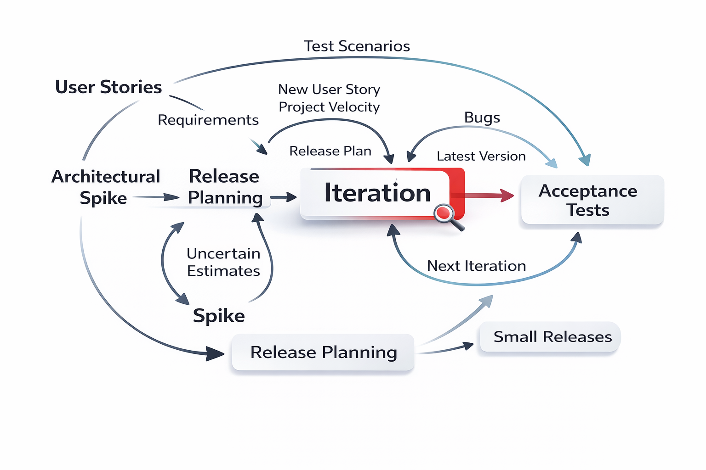

### The Eight Core Planning Practices

When we talk about planning in Extreme Programming, we need to understand eight interconnected practices:

- **Vision**: Defining where we are going and why we are building the product
- **Release planning – roadmap**: Determining how we will get there over time
- **The planning game**: Ensuring that everybody on the team contributes to planning decisions
- **Risk management**: Identifying and addressing potential problems before they derail the project
- **Iteration planning**: Structuring our daily activities within each development cycle
- **Slack**: Building in buffer time for unexpected issues, meetings, or problems
- **Stories**: Using customer-focused descriptions of features as the basic unit of work
- **Estimating – prediction**: Determining how long work will take to complete

### The Role of Vision in XP

Every project begins with a vision that focuses the team on the initial goal and idea:

- The **vision** is held by the **product manager**, who acts as its guardian
- It should be **short and specific**, capturing the essence of the project in a few sentences
- It must clearly state **why the project exists**—the reason for its creation
- It describes **what the project should accomplish**, whether that is an opportunity to be seized or a problem to be addressed
- It explains **why the project is valuable** to the organization and its users
- It includes **success criteria**: concrete, clear, and unambiguous targets that define what "done" and "successful" look like
- The vision directly impacts **planning decisions and prioritizing stories**, ensuring every choice aligns with the project's core purpose

### Release Early and Often

A fundamental principle of XP is to release early and often:

- We achieve this by **including less** in each release, keeping releases **small and frequent**
- We keep **features small** so we can get **quick feedback** from real users
- This leads to the concept of a **Minimum Marketable Feature (MMF)** —the smallest set of functionality that delivers value and can be marketed to users
- **Stories are composed into a feature**, meaning multiple stories combine to form a coherent piece of functionality
- We decide on a **group of features** for each release based on **business value and priority**
- We should focus on **unique, distinguishing features**, rather than matching the competition
- For example, for a **word processor**, we might focus on innovative collaboration capabilities rather than simply copying features from other products

### Learn More and Adapt

One of the great strengths of Agile is the ability to learn more and adapt as we progress:

- We must **adapt plans** according to the **feedback** we receive from users and stakeholders
- There is **inherent lack of knowledge** at the beginning of any project—we cannot know everything upfront
- We **learn more on the way**, gaining understanding as we build and release
- We should take the opportunity to **adapt and create more value** based on that learning
- We need to actively **create opportunities to learn more**, such as conducting **beta tests** with real users
- Throughout this process, the **value of a product** should be proportional to the **investment** made in it
- We should **keep our options open** and defer decisions until we have the information we need—this is the principle of the **last responsible moment**

### Vertical Versus Horizontal Stripes

When planning releases, we need to think about how we slice functionality:

- We should build a **plan to release anytime**, meaning after any iteration we could potentially release working software
- To achieve this, each **story must be releasable**, delivering end-to-end value on its own
- Stories are **built on top of another**, creating a growing foundation of working functionality
- We achieve this by focusing on **vertical stripes** rather than horizontal layers
- A **vertical stripe** implements a small piece of functionality across **all layers of the system**—from user interface down to database
- A **horizontal stripe** would implement one layer across many features (e.g., "all the database work" or "all the UI work")
- **Vertical stripes** ensure each story is a complete, working slice of the product that could theoretically be released

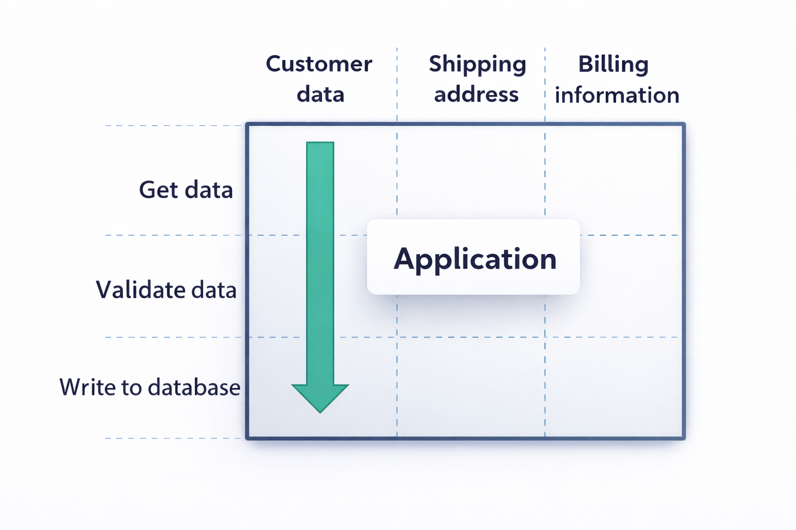

### Scope-Boxed Versus Time-Boxed Planning

There are two fundamental ways to constrain a project:

- **Scope-boxed**: We commit to delivering a fixed set of features, and the deadline can slip
- **Time-boxed**: We commit to a fixed deadline, and the scope can be adjusted

XP strongly favors the time-boxed approach because:

- It **forces prioritization** towards high-value features
- When we have a **fixed deadline**, we naturally implement the **highest-value, lowest-cost stories** first
- This ensures we always deliver the **most important functionality** within the available time
- If time runs out, the **least valuable features** are the ones left undone

### The Release Plan

The release plan in XP is deliberately simple and visible:

- A **release plan** is a list of stories stuck on a **whiteboard**
- This **low-tech approach** keeps planning **transparent and accessible** to the entire team
- Anyone can see what is planned, what is in progress, and what is completed
- Stories can be **easily rearranged** as priorities change
- The plan becomes a **living document** rather than a static artifact locked in a document

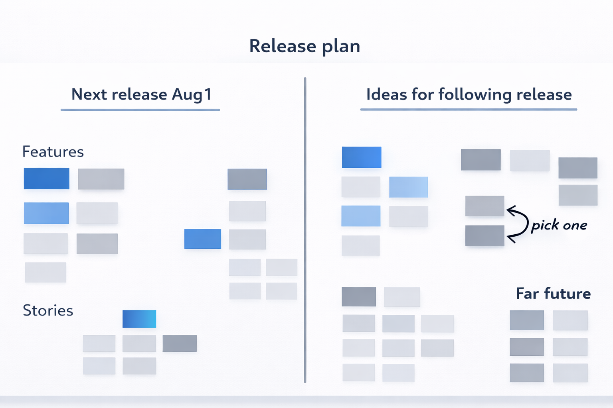

### The Last Responsible Moment

The concept of the last responsible moment deserves careful attention:

- We put a lot of **time and effort** into brainstorming, estimation, and prioritization
- This effort is **wasted** when plans are changed soon after we make them
- Our goal must be to **reduce waste**!
- To do this, we do not try to **plan everything at the beginning**
- Recognize that the **more uncertainty** we face, the more likely changes will be
- We should wait until **more is known** before locking in detailed plans
- We **continuously adjust** the planning horizon based on how much visibility we have into the future
- This is the essence of the **last responsible moment**—making decisions just in time, with the best available information, but not so late that we eliminate valuable options

### Starting Points for an XP Project

When beginning an XP project, we need a clear sequence of starting points:

- Define the **vision** for the entire project—this gives us the big picture and long-term direction
- Define the **minimum marketable features** for the current release—identify the smallest set of functionality that delivers value and can be released to users
- Define **all the stories** of the features of the first release—break down each feature into individual customer-focused stories
- **Estimate and prioritize** stories for the current iteration—determine which stories we will work on right now based on value and effort

### The Planning Game

The planning game is a structured approach to creating a plan that benefits from both business and technology expertise:

- It allows the team to benefit from both **business and technology expertise**
- It provides a **structured approach** for creating a plan that everyone understands
- It ensures the **maximum amount of information** is contributed to the planning process
- **Everybody contributes** to the decision—planning is a team activity, not a top-down mandate
- The **customer knows the value** of each story, and this knowledge is used for prioritization
- The **programmers know the cost** (effort) of each story, and this knowledge is used for estimation

### Steps of the Planning Game

The planning game follows a simple but powerful sequence:

- **Programmers estimate** the story—they determine how much effort each story will require
- **Customers place the story** into the plan in order of its relative priority—based on business value
- This process involves **interactive discussions** between customers and programmers
- Key questions drive these discussions:
  - What is **costly**, and why? (programmers explain technical challenges)
  - What is **valuable**, and why? (customers explain business priorities)

### Alternatives for Planning

It is helpful to contrast the planning game with traditional approaches:

- **Traditional approach**: Gantt charts
  - Focuses on **tasks and schedule**
  - Emphasizes **what individuals are doing** and when
- **Planning game**:
  - Focuses on **results**, i.e., what the team produces
  - Emphasizes delivering **working software**, not tracking individual activities
  - Shifts attention from "who is doing what" to "**what are we delivering**"

### Risk Management in XP

Risk management is about making and meeting long-term commitments, even though things will go wrong. The process includes:

- Create a list of **risks unique** to the project—every project has its own specific risks
- **Brainstorm** about possible catastrophes and perform a **root-cause analysis**—understand what could go wrong and why
- **Estimate probability** (high, medium, low) of each risk occurring
- **Estimate impact**—what would be the consequences? (extra costs, project cancellation, etc.)
- For each risk, we need to determine:
  - **Transition indicators**: when will we know the risk is becoming real? (stories on monitoring)
  - **Mitigation**: what can we do to reduce the impact? (stories on how to reduce the impact)
  - **Contingency activities**: what will we do after the risk occurs?
  - **Risk exposure**: how much time and money should we set aside to contain the risk?

Risk management is not a one-time activity—it requires ongoing attention:

- Someone is assigned to **track risks**—ownership is important
- Risks are **reviewed every week**—regular attention keeps them visible
- During each review, we:
  - Check **transition indicators**—are any risks becoming active?
  - Check if risks are **still applicable**—has the situation changed?
  - Check if there are **new risks** to consider—has anything new emerged?

### Iterations in XP

An iteration in XP follows a structured rhythm with specific time allocations:

- **Demonstrate previous iteration**: less than 30 minutes—show what was accomplished
- **Hold retrospective on previous iteration**: 60 minutes—reflect on what went well and what could improve
- **Plan iteration**: 30 minutes to 4 hours—decide what to work on next
- **Commit to delivering stories**: 5 minutes—the team publicly commits to the plan
- **Develop stories**: remainder of the iteration—do the actual work
- **Prepare release**: less than 10 minutes—get ready to show the results

### Planning an Iteration

During iteration planning, we need to break stories down into concrete work:

- **Break down stories** into engineering tasks—for example:
  - Update the **build**
  - Implement **domain logic**
  - Add **database table** and associated objects
  - Create new **UI form**
- This is a **design activity**—we are thinking through what needs to be built
- However, we should **not dive into too much detail**—keep it high-level enough to estimate
- A good guideline: each task should take **1–3 hours** to complete by a pair

### Time Estimation for Tasks

Estimating tasks requires a structured approach to reach consensus:

- Everybody writes down an **estimate in ideal hours**—individually, without discussion first
- **Discuss** if necessary to have a consensus—compare estimates and talk through differences
- **Split up tasks** that take more than 6 hours—they are too big and need further breakdown
- **Merge tasks** that take less than 2 hours—they are too small and can be combined
- **Go over the plan as a team**:
  - Check the **estimations** from the previous iteration—how accurate were we?
  - Check the **available time** for the iteration—how many pair-hours do we have?
  - **Remove or simplify tasks** if not comfortable with the workload
  - **Add a story** if time is left after accounting for all tasks
- Finally **commit**—the team agrees to deliver the planned stories

### After the Planning Session

Once planning is complete, work begins with clear responsibilities:

- **Programmers do pair and volunteer** for a task, breaking up when the task is done and picking up the next one
- **Customers and testers** keep an eye on the progress and are ready whenever needed to answer questions
- They prepare **customer and exploratory tests** in the meantime to be ready for validation
- The commitment is to **deliver stories**—not individual tasks
- Everybody is **responsible for the team's success**, not just their own piece

### Things Can Go Wrong

We must be prepared for problems during iterations:

- A **major problem** can result in a **lost iteration**—sometimes things go badly, and we accept that
- **Partially done work** should not be delivered—either a story is complete, or it is not delivered
- Every story should be "**done done**"—fully completed according to the definition of done
- Always **limit the product's scope, not quality**—if time is short, remove features, never compromise on quality
- **Delete the code** if not immediately to be followed—unfinished work that won't be continued soon should be removed
- **Daily iteration** could be adopted in case of very frequent urgent requests—for highly volatile environments

### The Nine Core Technical Practices

Extreme Programming includes nine essential technical practices that work together to ensure quality:

- **Incremental requirements**: Evolving requirements through customer collaboration
- **Customer tests**: Automated tests that capture business rules
- **Test-driven development**: Writing tests before code
- **Refactoring**: Improving design without changing behavior
- **Simple design**: Keeping the design clean and elegant
- **Incremental design and architecture**: Evolving architecture over time
- **Spike solutions**: Short experiments to reduce uncertainty
- **Performance optimization**: Making changes based on measurement, not guessing
- **Exploratory testing**: Manually exploring to find unexpected issues

### Incremental Requirements

In XP, requirements are not captured in massive documents—they are developed incrementally:

- **On-site customers** act as living requirements documents—the best source of requirements is a real person, not a written specification
- **Customers collaborate** with programmers to learn about the implementation cost—this two-way conversation helps everyone understand trade-offs
- Requirements exist as an **informal list** as a reminder, under version control—keep them simple but track changes
- Requirements are **incrementally refined** in parallel with the rest of the team's work—they evolve as understanding grows
- Changes are captured through **story cards**—simple physical or digital cards representing new requirements

### Customer Tests

Customer tests bridge the gap between business rules and technical implementation:

- The **customer is involved**, interacting with testers throughout the process
- Tests help communicate **tricky domain concepts** that are hard to explain in words
- These are **automated tests** that implement domain rules—they verify the system behaves according to business requirements

Customer tests are created in three steps:

- **Describe**: Have a brief discussion about the requirement
- **Demonstrate**: Work through concrete examples together
- **Develop**: Implement the rules as automated tests

Important principles:

- Focus on the **essence of business rules** rather than the possible usage of the system
- These tests typically require **tool support** other than a Unit Testing Framework—they may use specialized acceptance testing tools

### Test-Driven Development (TDD)

Test-Driven Development is a foundational practice that ensures code is produced in small, verifiable steps:

The result is code that is:

- **well-designed**
- **well-tested**
- **well-factored**

The TDD process has several key characteristics:

- It operates in a **rapid cycle** (less than 5 minutes) of testing, coding, and refactoring
- You immediately get **alerted by mistakes** and fix them, which eliminates the need for debugging
- Tests focus on **external behavior**, which forces you to think about the design of interfaces before implementing them
- The resulting tests remain as **living documentation**—they show exactly how the code is supposed to work
- Tests are reused for **detecting software regression**—when something breaks, tests catch it immediately

### The TDD Cycle

The TDD cycle operates at a very fine-grained level:

- **Cycles are fewer than 5 minutes**—from test to code to refactor and back
- You write up to **5 lines of code** each time—very small increments
- **Tests run in under 10 seconds**—so you can run them constantly without slowing down

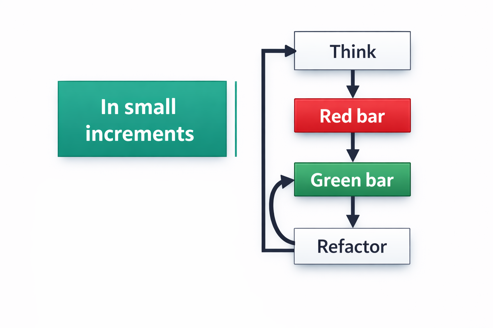

### Types of Tests

Different types of tests serve different purposes in XP:

Unit tests:

- Focus on a **class or a method**—narrow scope
- **Hundreds run per second**—very fast
- **No database, network, file I/O**, external resources, or configuration—completely isolated
- **Unable to test independently** is a sign of bad design—if you cannot isolate a class, the design needs improvement

Focused integration tests:

- **Narrow focus** on the interaction with the outside world—test boundaries
- A **handful run per second**—slower but still fast
- Require **proper setup and tear down** to avoid polluting the environment

End-to-end tests:

- Require **seconds per test**, exploring many branches top-down
- **Necessary if other tests are insufficient**—they catch issues that unit and integration tests miss
- Test the **entire system** working together

### Mock Objects

Mock objects are a technique for isolating code during testing:

- Used for **isolating classes** for unit testing—replace real dependencies with test doubles
- Involve substituting the real object with a **pre-scripted response**
- Should be a **last resort** to decouple the design—if you need mocks, the design may be too tightly coupled
- Always **improve the design** before exploiting mock objects—fix coupling issues first, then use mocks if still needed

### Dealing with Legacy Code

Legacy code has a specific definition and requires a careful approach:

- Legacy code is code you are **afraid to change**, code **without tests**
- It carries **high technical debt**—expensive to modify and risky
- The approach to legacy code:
  - First, write **smoke tests**—end-to-end tests to alert if something breaks down
  - Focus on **common usage scenarios** that cover the most important paths
  - Then—after you have safety nets—write **unit tests**
  - Then—with tests in place—**refactor** to improve the design

### Refactoring

Refactoring is a disciplined technique for improving code:

- Refactoring means **changing the design** of the code (how) without changing its **behavior** (what)
- It consists of **small transformations**—tiny steps that preserve behavior
- It is a **reflective design activity** attacking **code smells**—identifying and fixing common design problems
- Common **code smells** that refactoring addresses include:
  - **Divergent change and shotgun surgery**: When one change requires modifying many different classes
  - **Primitive obsession and data clumps**: Overusing primitive types instead of creating meaningful objects
  - **Data class and wannabe static class**: Classes that hold data but lack behavior
  - **Coddling nulls**: Excessive null checking that obscures logic
  - **Time dependencies and half-baked objects**: Code that depends on things happening in a specific order or objects that are not fully initialized

### Simple Design

Simple design is a core value in XP that guides how we approach coding decisions:

- **Avoid speculative coding** by not building functionality that you might need in the future but do not need right now—this prevents wasted effort and unnecessary complexity
- **Remove duplication** wherever you find it because duplicate code makes the system harder to change and increases the risk of bugs when changes are made in only some of the duplicate locations
- **Write self-documenting code** by using meaningful names, clear structure, and simple logic so that the code explains itself without requiring separate comments
- **Isolate third-party components** by wrapping external libraries and frameworks behind your own interfaces, which makes it easier to replace them later if needed
- **Limit published interfaces** to only what is necessary because every exposed interface creates a commitment that will be difficult to change later
- **Fail fast** by detecting and reporting errors as early as possible, preferably at the point where they occur, rather than allowing them to propagate through the system
- **Make use of design patterns** when necessary, but only when they genuinely solve a problem rather than just because they seem like a good idea

### Incremental (Evolutionary) Design

Design in XP evolves over time rather than being completed upfront in a big design phase:

- **Start with a simple, specific design** that solves the immediate problem rather than trying to anticipate future needs
- **Wait before creating abstractions** until you see the same pattern emerge multiple times, because abstractions created too early are often wrong
- **Progressively review and refactor the design** as you go, with the goals of making it more general as patterns emerge and simplifying and clarifying the code
- **Apply the same practice of TDD** but scale it up to the architecture level, using tests to guide architectural decisions
- **Choose improvements that reduce future risk** through what is called risk-driven architecture, meaning you focus on areas where the wrong decision would cause the most problems
- **Keep discussions less than 10 minutes** because if a design discussion goes longer than that, you need to stop and create a spike solution to explore the options instead of continuing to debate

### Continuous Design

A quote from Ron Jeffries captures the essence of XP design:

> "Design is so important in XP that we do it all the time"

This continuous design happens at different scales throughout the project:

- **Class-level refactorings** occur several times per day as programmers constantly improve the code they are working on
- **Architecture-level breakthroughs** happen every few months as the accumulation of many small refactorings leads to major improvements in the overall structure

### Spike Solutions

Spike solutions are experiments designed to reduce uncertainty when the team faces technical questions:

- **Spikes are small, isolated experiments** to learn more about a technical problem, such as whether a particular library will work or how to implement a difficult algorithm
- They are implemented as **small programs or tests** that explore the specific issue without the complexity of the full production code
- The purpose is to **clarify technical issues** by setting aside the complexities of the production code so you can focus on the specific question
- **Never copy spike code into production** because spike code is written for exploration, not for quality, and it likely contains shortcuts and assumptions
- **Throw away the spike when done**, or use it as documentation to capture what you learned, but do not treat it as production-ready code
- Spikes are **not meant to be generic or useful** beyond answering the specific question that prompted them

### Exploratory Testing

Exploratory testing is a manual testing approach focused on discovery rather than confirmation:

- The goal is to **find surprises, gaps, and holes** in the software that automated tests might miss
- Sessions typically last **1–2 hours per session** to maintain focus and effectiveness
- Tests are **designed incrementally** based on what you discover as you explore
- Each session has a **charter** that defines the focus or goal of the exploration, similar to a test story
- Testers practice **observation beyond test results**, noticing unexpected behaviors, performance issues, or usability problems
- **Bookkeeping is important** to record what was tested, what was found, and any questions that arose
- Testers apply **heuristics such as boundary testing or security attacks** to guide their exploration
- The results provide **feedback for both the software and the process**, revealing not only bugs but also areas where the development process could improve

### Habit of Mindfulness

Mindfulness in XP means paying continuous attention to how the team works and how the software is evolving:

- **Pair programming** keeps both programmers focused and aware of what they are building
- An **informative workspace** shows the team's status and progress at a glance
- **Root-cause analysis** helps the team understand why problems occurred rather than just fixing symptoms
- **Retrospectives** provide regular opportunities to reflect on and improve the team's process

### Pair Programming

Pair programming is a practice where two programmers work together at one computer:

- The goal is to **help each other succeed** rather than to compete or monitor
- One person, called the **driver**, writes the code and focuses on creating rigorous, correct code without worrying about the big picture
- The other person, called the **navigator**, thinks **strategically** and focuses on issues like whether the approach is sound, what edge cases might exist, and where the code is going next
- Together they create **higher quality work more quickly** than either could alone

### Pair Programming Benefits

Pair programming provides several important benefits that improve both the code and the team:

- **Positive pressure** comes from having a partner, which encourages both programmers to stay focused and do their best work
- **Coding knowledge and tips** spread naturally through the team as people pair with different colleagues
- **More focus and fewer interruptions** occur because pairs tend to stay on task better than individuals working alone

### How to Pair?

Effective pairing requires following certain guidelines about when and how to apply the practice:

- Use pairing for **all production code** and anything else that needs to be maintained over time
- Pair with **everyone in the team** in an ad-hoc fashion, rotating partners frequently so knowledge spreads
- **Collaborate, don't critique**—the goal is to work together, not to judge each other
- The navigator should **not interrupt the driver frequently** because constant interruptions break the driver's flow
- **Notes can be taken** instead of interrupting, saving observations for a natural break point

### When to Pair?

The timing and rhythm of pairing are important for effectiveness:

- **Switch pairs** several times a day if possible to spread knowledge and keep perspectives fresh
- **Switch roles** at least every half hour so both programmers stay engaged and understand both the tactical and strategic aspects
- If possible, **switch every few minutes**—whenever the driver gets tired or the navigator starts telling which keys to press, it is time to switch roles

### Concerns for Pairing

Pair programming is not always easy, and teams should be aware of potential challenges:

- **Comfort** can be an issue because some people find close collaboration with others uncomfortable or exhausting
- **Highly mismatched skills** can make pairing difficult if one person is much more experienced than the other
- **Communication style differences** may lead to frustration if not addressed
- **Lack of standard toolset and coding conventions** makes pairing harder because people have to constantly adjust to each other's preferences

### Two People for One Job—Isn't It Wasteful?

This is a common concern about pair programming, but it misunderstands what programming involves:

- Programming is **not just typing statements**—much of the work involves thinking, problem-solving, and design
- The **navigator is thinking ahead**, anticipating problems, and reflecting on strategies rather than just watching
- The pair produces **better design, fewer bugs, and shared knowledge** that makes the whole team more effective
- **Do not push, and avoid strict rules**—pairing should feel helpful and productive, not forced or uncomfortable

### Informative Workspace

The physical or virtual workspace should actively communicate information to the team:

- The workspace should be **broadcasting information** to everyone who enters, showing the current state of the project
- Use **big, visible, hand-drawn charts** because they are easy to create, update, and understand
- Include **process improvement charts** that show metrics such as the amount of pairing happening, how often pairs switch, build performance, number of tests, and number of outstanding requests
- **Review the use of each chart regularly** and remove any that are not helpful to avoid clutter and maintain focus
- Charts are **not to be used for performance evaluation**—they are for team awareness and improvement, not for judging individuals

### Retrospectives

Retrospectives are regular meetings where the team reflects on its process and identifies improvements:

- The purpose is to **continually improve work habits** based on actual experience
- Teams **update their process** to match the unique properties of the team rather than following a prescribed process blindly
- The **iteration retrospective** is the most common, happening at the end of each iteration
- Other types include **release retrospectives**, project retrospectives, and surprise retrospectives
- **Anybody can lead** a retrospective, but everybody should join because everyone's perspective matters
- **Do not keep retrospectives too long**—about one hour is usually sufficient

### Possible Retrospective Schedule

A typical retrospective might follow this structure to keep it focused and productive:

- Begin with the **prime directive** to set the right mindset
- Spend **30 minutes on brainstorming** to gather everyone's observations
- Use **10 minutes for mute mapping**, where team members silently organize and group the brainstormed items
- Allocate **20 minutes to define the retrospective objective**, deciding what to focus on improving

### Norm Kerth's Prime Directive

Every retrospective should begin with this principle:

> "Regardless of what we discover today, we understand and truly believe that everyone did the best job they could, given what they knew at the time, their skills and abilities, the resources available, and the situation at hand"

### Brainstorming Categories

During the brainstorming phase, team members generate observations about the previous iteration:

- **Categorize events** to make the brainstorming more structured and useful
- Identify what was **enjoyable** about the iteration, so the team knows what to continue doing
- Identify what was **frustrating** so problems can be addressed
- Identify what was **puzzling or confusing**, which may indicate areas needing clarification
- Note what should **stay the same** because it is working well
- Note what the team should **do more of** because it adds value
- Note what the team should **do less of** because it wastes time or creates problems

### Retrospective Objective

After brainstorming, the team must decide what to actually change:

- **One category should be selected as the winner** to focus improvement efforts on the most important area
- If **no clear winner emerges**, do not spend more time trying to force one because sometimes no major changes are needed
- The team then **generates specific ideas for improvement** related to the chosen category
- Everyone **votes for the best improvement idea** to ensure that the whole team supports the change
- Someone is **assigned to follow up** on the chosen improvement in the next iteration, ensuring actual change

### Eight Main Practices

Beyond the technical practices, XP includes eight main collaborative practices that shape how the team works together:

- **Trust** is the foundation that makes all other practices possible, without which no process can succeed
- **Sitting together** means arranging an open workspace where everyone can see and talk to each other easily
- **Real customer involvement** means having actual customers available to the team, not just representatives
- A **ubiquitous language** means programmers should speak the language of the domain experts
- **Stand-up meetings** are held daily for about 10 minutes, with each person speaking for roughly 30 seconds
- **Coding standards** are established and followed by everyone, ensuring consistency across the codebase
- **Iteration demos** are held every week to show working software to stakeholders and gather feedback
- **Reporting** is done only when necessary, focusing on meaningful information rather than unnecessary documents

### About Trust

Trust is essential in XP and manifests in multiple ways throughout the team's interactions:

- **Programmer-tester empathy** means developers and testers understand each other's challenges and work together
- The team understands that **mistakes are not a sign of incompetence** or laziness—they are inevitable and provide learning opportunities
- **Programmer-customer empathy** means developers understand the business pressures customers face
- **Sitting and eating together** helps build personal relationships that strengthen professional collaboration
- **Keeping team continuity** means organizations should treat the team, not individuals, as the resource
- **Eliminating wrong impressions** requires actively addressing misunderstandings before they become problems
- **Transparency** means making problems known to everyone rather than hiding them, so the whole team can help solve them

### Reporting: Only If Necessary

Reporting in XP is kept minimal and focused on what actually matters:

- The **vision statement** reminds everyone why the project exists and what it aims to achieve
- **Weekly demos** show working software rather than just reporting on progress through documents
- **Release and iteration plans** communicate what the team intends to build in the coming weeks
- **Burn-down charts** show progress against the plan in a visual, easy-to-understand format
- **Time tracking** helps the team understand how effort is distributed across different activities:
  - Improving **skills** through training and research
  - **Planning** activities, including retrospectives and demos
  - **Developing** work, including testing, coding, and refactoring

### Six Completion Practices

To ensure that work is truly finished, XP includes six practices that define what "done" means:

- "**Done done**" means everyone shares the same clear definition of completion, which includes:
  - The work is **tested, integrated, and deployable**
  - There are **no known bugs** in the completed work
  - **TDD, refactoring, and exploratory testing** have been applied
- **Version control** means maintaining a central, clean repository for all project artifacts, not just code
- **Ten-minute automated build** means the entire system can be built and tested in under ten minutes, including:
  - Not just compilation but also all **settings and configurations**
  - **Fast, focused tests**, mostly unit tests that run quickly
- **Continuous integration** means integrating work every few hours, using:
  - A **centralized integration machine**
  - An **integration token** or similar mechanism to prevent conflicts
- **Collective code ownership** means everybody is responsible for all parts of the codebase

### A Story Is Completed When...

A story in XP is considered truly complete only when it meets all of these criteria:

- **Tested**—all automated tests pass and any necessary manual testing has been performed
- **Coded**—the implementation is finished according to the requirements
- **Designed**—the code follows good design principles and has been refactored
- **Integrated**—the code has been merged with the main codebase and works with existing functionality
- **Built**—the system compiles and builds successfully with the new code included
- **Reviewed**—the code has been reviewed, through pair programming or a separate process
- **Accepted**—the customer has confirmed that the story meets their expectations

### About Documentation

XP takes a pragmatic approach to documentation, valuing effective communication over comprehensive written records:

- The motto is to **communicate necessary information effectively**—documentation should serve a clear purpose
- Most communication happens **face-to-face** because direct conversation is the most efficient and effective
- **Tests and informal documentation** serve as executable specifications that never go out of date
- Key documentation that remains valuable includes:
  - **Vision statement** explaining why the project exists
  - **Design sketches** capturing important architectural decisions
  - **Story cards** recording customer requirements
  - **Product documentation treated as a story**—when users need documentation, that becomes a requirement
- For **handoff situations** where the team will not continue, additional documentation may include:
  - **Overall design and features**
  - **Error conditions** and how to handle them
  - **Strategies for gradual migration** and updates

## Feature-Driven Development (FDD)

### Yet Another Agile Method?

When we study agile methods, we encounter several different approaches, and it is natural to wonder how they compare:

- **XP, Scrum, Lean—now what?** What is different about Feature-Driven Development? Each agile method has its own focus and strengths, and FDD offers a unique combination of practices
- **Feature-Driven Development (FDD)** focuses on planning, monitoring, and reporting rather than just on technical practices or team collaboration
- **FDD is closer to traditional, linear methods** in its approach to planning and tracking, which makes it more comfortable for organizations used to waterfall projects
- It represents a **combination of agile principles combined with some traditional practices**, creating a hybrid approach that appeals to certain contexts

### History of FDD

Understanding the origins of FDD helps explain its character and strengths:

- **FDD was first introduced in 1999**, making it one of the earlier agile methods
- It emerged from the **process followed by Jeff DeLuca's company** combined with Peter Coad's concept of features, blending practical experience with a clear conceptual model
- The method was **first applied on a 15-month, 50-person project** for a large Singapore bank in 1997, demonstrating its viability on a substantial project
- It was later **followed by a second, 18-month long 250-person project**, proving that the approach could scale to very large teams

### FDD in a Nutshell

The essence of FDD can be summarized in several key points:

- **FDD is a plan-driven approach** that adopts agile principles, meaning it maintains the discipline of planning while embracing agile values
- It has **not come forward as a popular agile method** compared to Scrum or XP, but it remains valuable in specific contexts
- **FDD might be a better fit for larger teams and projects** where the dynamics differ from the small, co-located teams that agile methods typically assume
- This is because the **assumptions of an agile method do not always hold in larger teams**—for example, not everybody can be highly skilled or disciplined when you have fifty or two hundred people on a project

### Demand for Planning and Monitoring

Even in agile projects, management has legitimate needs that must be addressed:

- **Management will still wish to monitor the progress** against some planning element, regardless of whether the team is using agile or traditional methods
- **FDD addresses this by defining the concept of a feature**, which mixes the units of requirements with the units of management, meaning the same items used to describe what the system does are also used to track progress

### Linear Models for Easy Management

Traditional linear models like Waterfall have characteristics that make them attractive to management:

- **Linear models like Waterfall are easy to manage** because they follow a predictable sequence of phases
- In a linear model, you have the **complete requirements before design begins**
- **Design is complete before implementation starts**, providing clear boundaries between phases
- There can be **possible feedback between phases**, yet the majority remains as initially expected, so the overall plan remains stable

### Simple but Usually Unrealistic

Despite their appeal, linear models have fundamental problems:

- **Planning is easier in waterfall models** because you are fixing many variables—requirements, design, schedule, and budget are all determined upfront
- There are **clear borderlines between phases**, making it obvious what stage the project is in
- However, this approach **might be realistic only if the fifth or sixth system is being developed** in the same application domain for the same type of application, meaning the team has built essentially the same system multiple times before
- In reality, **changes and iteration between phases can occur inevitably**, no matter how much upfront planning is done

### Inevitable Changes

Linear models break down when faced with uncertainty:

- **Linear models fall short when new technologies are involved** because the team lacks experience with the tools
- They struggle when **requirements are unclear, uncertain, or imprecise** because the model depends on knowing everything upfront
- Problems arise when the **domain is new or not well-known** because the team cannot accurately predict what will be needed
- Linear models fail when there are **too many unknown variables** that cannot be fixed at the start
- In an agile method, we **acknowledge that there are many variables in the real world**, and instead of pretending they do not exist, we adopt an iterative model, rather than linear

### Iterative Model Has a Catch

While iterative models handle change better, they introduce their own challenges:

- **Iterative lifecycles are complex** compared to the straightforward sequence of linear models
- They require **more planning and re-planning** as the team adapts to new information
- There is **more assessment needed** at the end of each iteration to evaluate progress and direction
- Teams must **exercise more judgment** in deciding what to do next rather than following a predetermined plan
- There is **more monitoring required** to track progress through multiple cycles
- **FDD aims at managing this complexity** more effectively by providing structure around how features are defined, planned, and tracked

### Reflecting on XP

Comparing FDD to XP helps highlight where each method fits best:

- **XP uses iterations between 1 and 3 weeks**, keeping cycles very short
- Teams aim to **release after each iteration**, delivering value to users frequently
- **XP works best for small projects** with frequently changing requirements where close collaboration and technical excellence are paramount

This raises questions about other contexts:

- What if **iterations are almost a month long** and requirements are partially more stable? In such cases, the rapid pace of XP may be more than needed
- What if the **team is large and the organization demands a plan?** XP's informal approach to planning may not satisfy management's need for predictability

### uestions Awaiting an Answer

FDD was designed to address the needs that arise in larger projects with more formal governance:

- Organizations need a way for management to handle questions such as:
  - What must we do **next to add value?** This is about prioritizing work based on business value
  - How are we **progressing against time and budget?** This is the fundamental tracking question
  - What **issues and risks does the project face?** Management needs visibility into problems
  - How can we **address or mitigate these risks?** There must be a plan for dealing with them
  - **What should we do next?** This is the ongoing question of how to steer the project toward success

### Agile or Not Agile

When organizations adopt agile methods, they often struggle with a fundamental tension:

- The challenge is how to be **agile, yet under control**—how to maintain flexibility while providing predictability
- The answer is to adopt an **agile and adaptive method** that embraces change and uncertainty
- However, the organization must yet **not lose control** over the project's direction and outcomes
- This requires an **upfront management framework** that provides structure for decision-making and tracking
- It also requires **upfront architecture** to ensure that the system can evolve coherently over time
- Finally, the team must be able to **follow progress with respect to a plan**, even as the plan adapts

### Regaining Control: The Motivation Behind FDD

FDD was designed specifically to address the control problems that can arise in iterative development:

- There is a potential **explosion of planning effort** to deal with the iterative cycles
- Organizations still have a **demand for overall planning** and plan-based progress monitoring
- FDD provides a way to **satisfy these demands** while maintaining the benefits of iterative development

### Key Guidelines

FDD is built on several key guidelines that shape its approach:

- The process should be **feature-centric**, meaning that features are the primary organizing principle
- The **units of requirements should be unified with the units of planning**, so progress is easier to track
- Planning should be **based on timeboxes rather than phases**, following the agile principle
- The **plan should be adaptive** to respond to changing risks and benefits, rather than fixed at the start

### Combining the Units of Requirement with the Units of Planning

This unification of requirements and planning is central to how FDD works:

- The purpose is to **control planning and management** within an iterative process
- **Features represent the things users want** from the system, capturing requirements
- These same features are to be **planned for and monitored** as the units of progress tracking
- They are also to be used as the **basis of work allocation**, so everyone knows what they are working on

### Feature-Centric Development

In FDD, the feature takes on a specific meaning that differs slightly from how other methods use the term:

- A feature is a **plannable functionality**—something that can be scheduled, assigned, and tracked
- Each feature has a **priority** that determines when it should be worked on
- Each feature has a **cost estimate** that helps with planning and budgeting
- Each feature requires **certain resources** to implement
- Features are **schedulable**, meaning they can be placed into specific timeframes
- Importantly, features are **derived from a planning perspective** rather than from the user perspective alone

### Features

FDD defines features with specific characteristics that make them useful for planning:

- Features are **small, typically taking 1 to 3 days** to implement—easy to estimate and track
- They are **useful with tangible benefits**, meaning each feature delivers something of value
- Features can be **grouped into feature sets** that represent larger areas of functionality
- They are **prioritized** so the team knows what to work on first
- They are **schedulable**, meaning they can be placed into specific timeframes
- Each feature is associated with an **estimated cost** that helps with planning and budgeting
- Features can be **grouped within iterations** of approximately 2 weeks

### Features at Different Levels

FDD recognizes that features can exist at different levels of abstraction within the system:

- **User level features** represent functionality that users directly interact with and value
- **Application level features** represent system-wide capabilities that may not be directly visible
- **Internal features** represent technical capabilities needed by developers, such as debugging support

This hierarchy of features allows the team to plan and track work at different levels of granularity, from high-level user functionality down to detailed technical tasks, while maintaining a consistent framework for management and monitoring.

### The FDD Process

Feature-Driven Development follows a structured five-step process that guides the project from initial understanding through to delivery:

- **1. Develop an overall model** of the domain and create an initial feature list
- **2. Build a detailed, prioritized feature list**—initial features are refined and arranged
- **3. Plan by feature**—features are allocated to iterations based on priority
- **4. Design by feature**—the team creates a detailed design for each feature
- **5. Build by feature**—designed features are implemented, tested, and integrated

### The Overall FDD Process

The FDD process operates within a clear timeboxed framework:

- Each iteration is **timeboxed**, meaning it has a fixed duration that does not change
- Each iteration has **features assigned to it** that the team commits to delivering
- **Features are initially pre-planned** throughout iterations at the start of the project, providing an overall roadmap

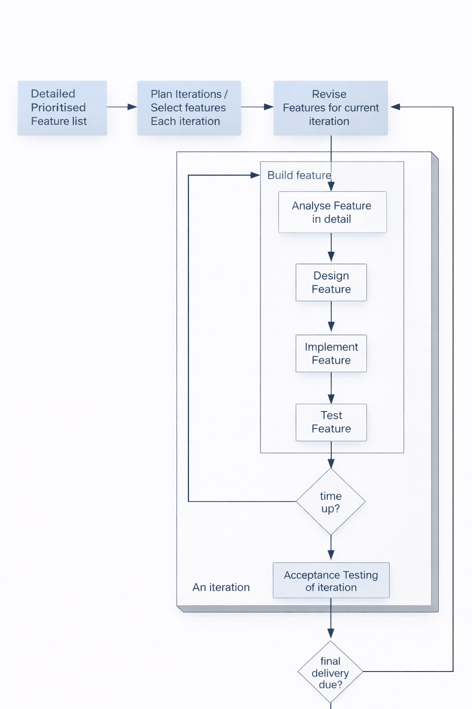

### Feature-Centric Development

In FDD, features are the central unit around which all planning and work is organized:

- A feature is a **plannable functionality**—something that can be scheduled, estimated, assigned, and tracked
- Each feature has a **priority** based on multiple factors:
  - **Architectural importance**—whether it is needed for the system's foundation
  - **Utility to the user**—how much value the feature provides
  - **Risks**—features addressing high-risk areas may be prioritized early
  - **Requirements of the system**—prerequisites for other features
- Each feature also has an **estimated cost in terms of effort**
- And each feature requires **certain resources to implement**, such as expertise or tools

### Example: Adding a New File

To understand how FDD works, consider this example of a requirement for a file auditing system:

- The requirement is to "**Add a New File**" to the system
- A **user story** might describe how the user would interact with the system
- This single requirement **breaks down into multiple related features**:
  - **New File Dialog**—the user interface component
  - **Java business objects** for new file creation—the backend logic
  - **New file details XML writer**—the functionality for persistence
- This example illustrates how a **single requirement can generate multiple features** that span different layers

### Sources of Features

Features in FDD come from various sources throughout the project lifecycle:

- **Requirements** are the most obvious source of features
- A feature can relate to **multiple requirements and vice versa**
- **Bug fixes** become features when they represent work that needs tracking
- **Maintenance enhancements** such as performance or usability are captured as features
- **Changing platform requirements** generate features
- **Refactoring activities** may be captured as features to ensure they are resourced

### How Long Should a Feature Take?

Determining the right size for features involves balancing multiple considerations:

- Features should usually **take a couple of days, typically 1 to 3 days**
- There is **no exact answer** that applies to all projects
- The appropriate size **depends on the size of the project, team, and application**
- The **definition can change** as the team gains experience and understanding

### FDD Process: Main Artifacts

FDD produces several key artifacts that support planning and tracking:

- **Features are documented** with:
  - **Priority rated as high, medium, or low**
  - **Cost estimated in person-days**
  - **Three-point estimate** including worst-case, average, and best-case
- **Iterations are planned** with:
  - **How many iterations** the project will have
  - **How long each iteration** will last
  - **Which features are allocated** to each iteration

A fundamental principle is that timeboxes do not change, but features can—if a feature cannot be completed within its scheduled iteration, it is moved to a later iteration rather than extending the timebox.

### Example: Legal Advice Expert System

To see how FDD planning works in practice, consider this example of a legal advice expert system project:

- **Five iterations are planned** for the entire project
- **Iteration 1: Explore the problem domain** and develop a prototype
- **Iteration 2: Extend domain knowledge** and confirm viability
- **Iteration 3: Commercial quality version**—robust enough for real use
- **Iteration 4: Additional features**—add supplementary functionality
- **Iteration 5: Final feedback** and deployment issues

This example shows how FDD provides a clear roadmap while remaining flexible enough to adapt as the project progresses and understanding grows.

### The Schedule: A Real-World Example

To understand how FDD works in practice, consider this example schedule from an actual project:

- **Iteration 1: Analyse and Prototype**—requires 58 person days, April 2003 to June 2003
- **Iteration 2: Prototype II**—requires 119 person days, July 2003 to December 2003
- **Iteration 3: Pilot and Develop**—requires 55 person days, December 2003 to February 2004
- **Iteration 4: Develop II**—requires 41 person days, March 2004 to April 2004
- **Iteration 5: Final Release**—requires 16 person days, late April 2004 to mid-May 2004
- A crucial principle is that each iteration is **planned in detail just before the start**, not before

### Planning for Each Iteration

When planning an individual iteration in FDD, the team works through a structured set of activities:

- **Feature list and requirement analysis**—review current features and new requirements
- **Plan features for the iteration**—select features based on priority and capacity
- **Break features into work packages and tasks**—decompose into concrete activities
- **Analyze impact on architecture**—understand how features affect system structure
- **Create acceptance test plan**—define how features will be validated
- **Implement features**—do the actual development work
- **Perform testing and deployment**—verify work and prepare for integration
- **Hold a post-iteration meeting**—reflect on accomplishments and improvements

### Three-Point Estimation

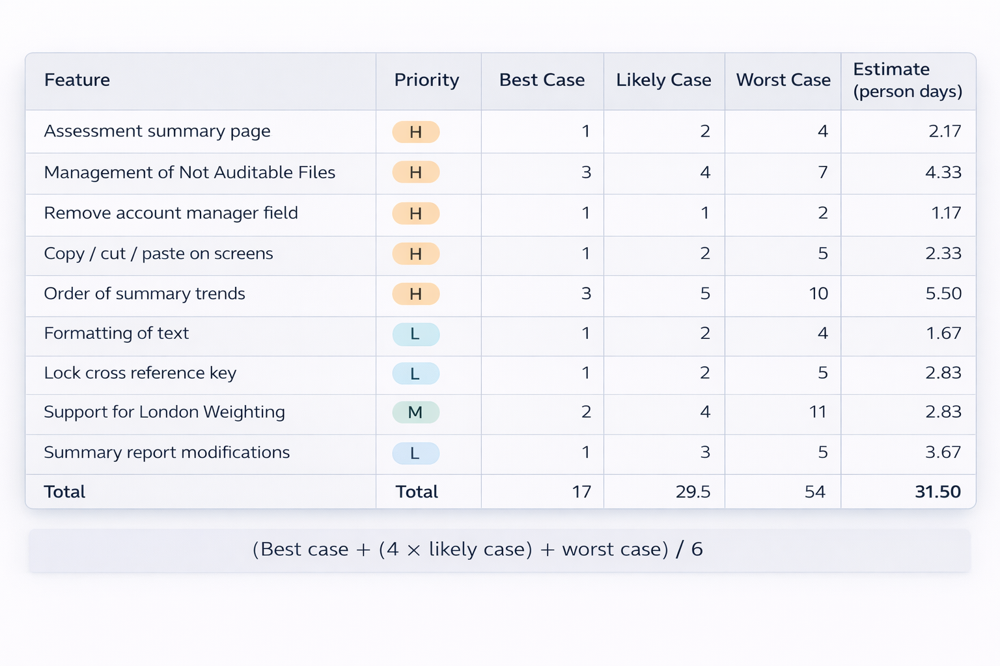

FDD uses three-point estimation to handle uncertainty in feature sizing:

- **Estimates are given as best case, average (likely), and worst case**
- These capture the **range of possible outcomes** rather than a single fixed date
- **Examples of feature estimation**:
  - **Assessment summary page**—priority high, estimate: 2.17 person days
  - **Management of Not Auditable Files**—priority high, estimate: 4.33 person days
  - **Remove account manager field**—priority high, estimate: 1.17 person days
  - **Copy/cut/paste on screens**—priority high, estimate: 2.33 person days
- **Weighted estimate formula**: (Best case + (4 × likely case) + worst case) / 6

### Architecture-Centric Development

FDD places strong emphasis on architecture as the foundation for iterative development:

- **Built on a solid architecture**—stable foundation is critical for maintenance
- **Architecture forms the skeleton**, providing support for all features
- **Blueprint/Overall plan** identifies structural elements and interfaces
- **Defines architectural style**—layered, client-server, or microservices
- **Specifies decomposition into subsystems**
- **Describes top-level interaction** between major components

### Why Architecture?

Architecture serves multiple purposes in an FDD project:

- **Understand the system**—grasp organization and how parts fit together
- **Organize development**—assign work and coordinate teams
- **Promote reuse**—identify and create reusable components
- **Control evolution**—accommodate change without collapsing

### What About Implementation?

An important characteristic of FDD is its scope:

- **FDD is only about management**—a framework for planning and tracking
- **Nothing about implementation practices**—code writing, testing, or detailed design
- **XP practices can be adopted** for actual development work

### Feature-Driven Development Process

This slide simply titles the section, reminding us that we are studying the FDD process as a whole.

### Example Domain Model: Reference Architecture

A reference architecture provides a template for organizing systems in a particular domain:

- **Reference architecture** defines core components and structure for a domain
- **Insurance System example**—policy management, claims, billing, etc.
- **Starting point** rather than designing from scratch each time

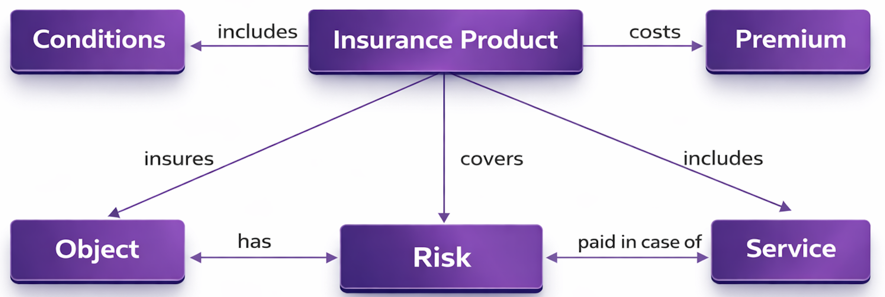

### FDD Overview

The entire FDD process can be summarized in these key steps:

- **Create a domain object model** with domain experts
- **Create a features list** based on the model and requirements
- **Draw up a rough plan** and assign responsibilities
- **Iterative design and build batches** of small groups of features

This approach combines upfront modeling and planning with iterative delivery, giving both structure and flexibility throughout the project.

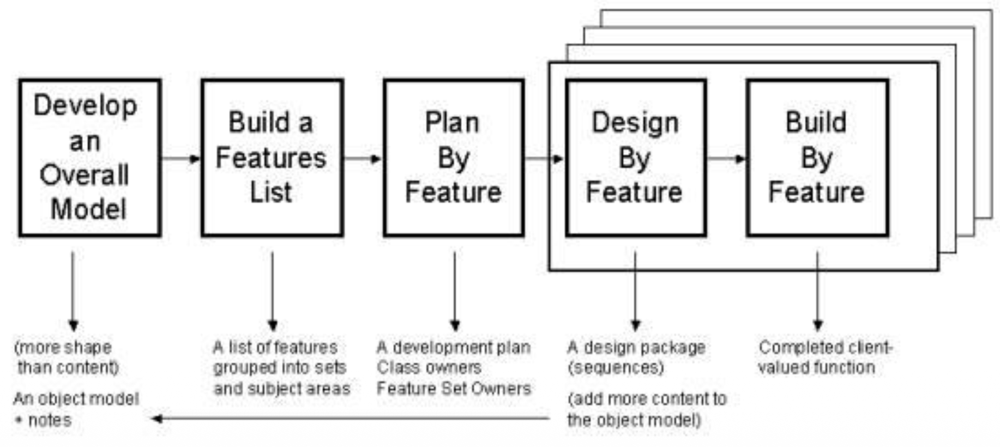

### Initial Phase: Developing the Overall Model

The first step in FDD involves upfront analysis, which might seem contradictory to agile principles:

- **Upfront analysis** might appear to be counterintuitive for **agile principles** because agile methods generally prefer **just-in-time analysis** over big upfront work
- However, this **initial analysis** is not a long activity—it is **timeboxed** and kept focused
- It is not turned into a **large, complicated report or document** that becomes outdated and ignored
- The goal is simply to gain a **good, shared understanding** of the **problem domain** among all team members
- This includes establishing **common concepts and vocabulary** that everyone uses consistently throughout the project

### Second Step: Building the Feature List

The feature list is a central artifact in FDD and has specific characteristics:

- **FDD** defines a **feature** as a small, **client-valued function** that delivers **tangible benefit** to users
- Features are usually expressed in the form: `action` `result` `object`—for example, "**calculate the total of a sale**" as described by Palmer
- This format ensures that features are expressed in a **consistent, understandable way**
- The **feature list** is not a **linear list** like the **Scrum backlog**—it is not just a flat sequence of items
- Instead, features are organized in a **hierarchy**, with **higher-level feature sets** containing multiple **related features**, which helps with planning and communication

### Third Step: Plan by Feature

Planning in FDD involves assigning responsibility for features while maintaining flexibility:

- The team assigns **individual developers** to be responsible for **specific features or feature sets**
- However, **pair programming** is not prevented—the assigned developer is not expected to work alone
- The key point is that **responsibility is not exclusivity**—being responsible for a feature means you ensure it gets done, not that you must do all the work yourself
- This approach combines **clear accountability** with the **flexibility to collaborate** as needed

### Fourth Step: Design by Feature

When designing a feature, FDD organizes the work in a specific way:

- The team should form a **feature team** of **3 to 5 people** to work on a small group of **related features**
- This size is small enough to be **agile** but large enough to bring **diverse perspectives**
- Working in feature teams creates a sense of **collective ownership** where everyone feels responsible for the success of the features they are working on

### Fifth Step: Build by Feature

The build step focuses on delivering completed, quality-assured features:

- Each feature must be **tested** to ensure it works correctly
- Each feature must be **inspected** to verify **quality and consistency**
- The **FDD process** neither mandates nor forbids **pair programming**—teams can choose the **technical practices** that work best for them
- This flexibility allows FDD to be combined with **XP practices** or other technical approaches

### Tracking Progress Through Six Milestones

FDD provides fine-grained visibility into progress by tracking each feature through six defined milestones:

- **Domain walkthrough**—ensuring the team understands what the feature requires from a **business perspective**
- **Design**—creating a **detailed design** for how the feature will be implemented
- **Design inspection**—reviewing the design for **quality and consistency**
- **Coding**—implementing the feature
- **Testing and code inspection**—verifying the implementation and reviewing the code
- **Promoted to build**—integrating the completed feature into the **main system**

The project maintains a feature list with their current position among the six milestones, giving everyone a clear view of progress at a granular level.

### Parking Lot Charts for Reporting

FDD uses parking lot charts as a visual reporting mechanism, particularly for senior management:

- These charts are designed for reporting to **senior management** who need **high-level visibility** without detailed technical information
- **Feature sets** are grouped into **subject areas** that make sense to the business
- For each feature set, the chart shows:
  - The **number of features** in that set
  - The **percentage of features completed**
- **Coloring** is used to convey status at a glance:
  - Features that have been **started** are shown in one color
  - Features that have been **completed** are shown in another color
  - Features that have **significant blockages** are highlighted to draw attention

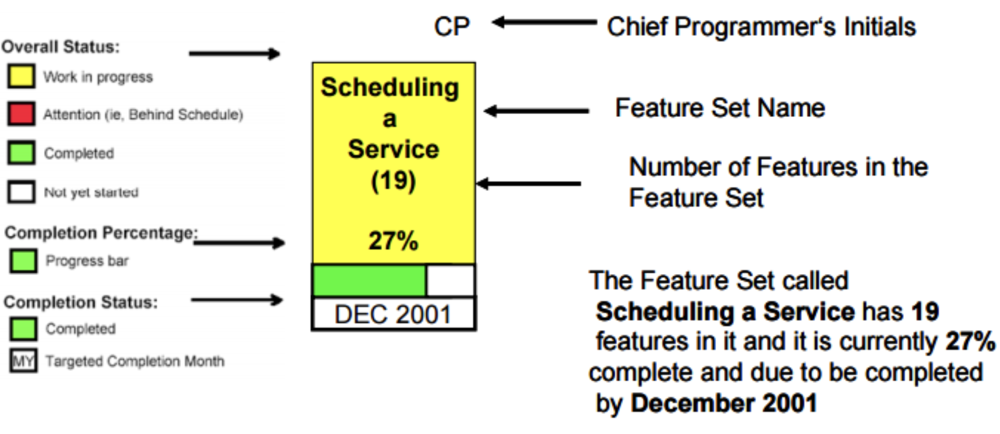

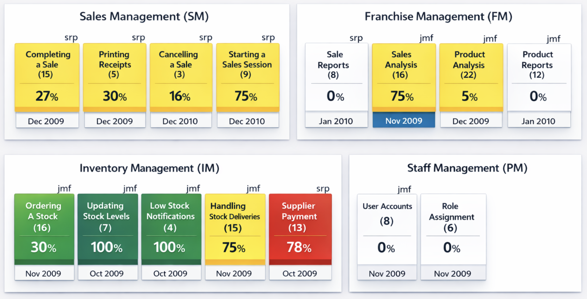

### Example Iterations

The table shows a real project plan with multiple iterations, each focused on different feature areas:

- **Iteration 1**: **File Review Audit**—13 weeks from September to December 2002
- **Iteration 2**: **Synchronization**—7 weeks from December to January 2003
- **Iteration 3**: **User feedback / usability**—6 weeks from January to March 2003
- **Iteration 4**: **Auditing of management processes**—4 weeks from March to April 2003
- **Iteration 5**: **Quality control audit**—3 weeks from March to April 2003 (overlapping with Iteration 4)
- **Iteration 6**: **Management Information Processing**—6 weeks from April to May 2003
- **Iteration 7**: **Additional Audit type 1**—5 weeks from May to July 2003
- **Iteration 8**: **Additional Audit type 2**—4 weeks from June to July 2003

This example shows how iterations can overlap when different teams work on different feature sets, and how the overall project is organized around delivering value in timeboxed chunks.

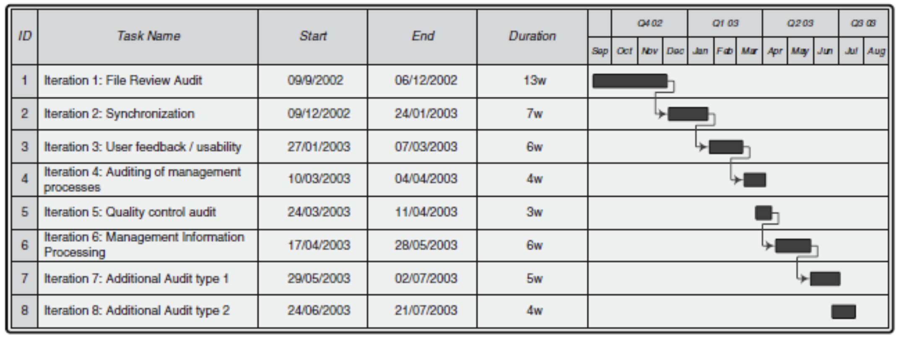

### Example Feature List

The table shows a sample feature list with priorities:

- **F01**: **Architectural changes**—priority **High**, involves changes to previous architecture required by new requirements
- **F02**: **Closed file report generation and printing**—priority **High**, generates a report currently produced by hand by auditors
- **F03**: **Summary and individual report generation**—priority **Medium**, a possibly optional feature to produce reports on each file
- **F04**: **Changes to main frame**—priority **High**, various screen changes required for new audit types
- **F05**: **Audit assembly**—priority **High**, allows users to create an audit by selecting appropriate files
- **F06**: **Loading an audit**—priority **High**, new audit types must be loaded into the system
- **F07**: **Writing out audits on completion**—priority **High**, saving file review audits after completion
- **F08**: **File review audit type**—priority **High**, a major new type of audit
- **F09**: **File review summary**—priority **High**, on-screen summary of all files reviewed
- **F10**: **Case file checklist**—priority **High**, a major component of file reviews

Each feature has a unique ID, a clear description, and a priority that guides planning decisions.

### FDD Summary

Feature-Driven Development can be summarized as a method that combines different approaches:

- **FDD** involves combining **agile practices** with **model-centric techniques**—it brings together the **flexibility of agile** with the **structure of modeling**
- It includes practices that **scale to larger teams and projects** where pure agile methods may struggle
- The method provides an **upfront conceptual and management framework** that gives **structure and visibility** while remaining **adaptable**

This combination makes FDD particularly suitable for organizations that need the benefits of agile but require more formal planning and reporting than methods like XP or Scrum typically provide.

## Unit Testing

### What Is Unit Testing?

Unit testing is a foundational practice in software development that focuses on verifying the smallest pieces of code:

- **Unit testing** involves testing **individual units** of source code in **isolation** and validating that each works properly—the goal is to verify each part **independently** before testing how parts work together
- A **unit** is the smallest testable part of an application, meaning it is a piece of code that can be **isolated and tested on its own**
- What counts as a unit depends on the **programming paradigm**:
  - In **procedural programming**, a unit is a **function** or an **individual program**—the basic building blocks of procedural code
  - In **object-oriented programming**, a unit is a **method** or a **class**—the fundamental elements of OOP design
- Different programming languages have their own **unit testing frameworks**:
  - **JUnit** for Java—the standard testing framework for Java development
  - **NUnit** or **MS Unit Tests** for **.NET languages like C#**—the equivalent frameworks for the Microsoft ecosystem
  - **CPPUnit** for **C++**—a framework for testing C++ code

### The Purpose of Unit Testing

Unit testing serves specific purposes in the development process:

- **Unit testing** is the practice using which **individual modules** are tested to determine if there are any issues by the **developer himself**—the developer writes and runs these tests, not a separate testing team
- It is concerned with **functional correctness** of the **standalone modules**, meaning it verifies that each module does what it is supposed to do when used in **isolation**
- The main aim is to **isolate each unit** of the system to identify, analyze and fix the **defects**—by testing units separately, problems can be found and fixed before they interact with other parts of the system

### Advantages of Unit Testing

Unit testing provides multiple benefits that improve both the development process and the resulting software:

- **Reduces defects** in the newly developed features or reduces bugs when changing the existing functionality—tests catch problems **immediately** rather than allowing them to hide in the code
- **Reduces cost of testing** as defects are captured in **very early phase**—the earlier a bug is found, the cheaper it is to fix, and unit testing finds bugs at the **earliest possible moment**
- **Improves design** and allows **better refactoring of code**—writing tests forces developers to think about how their code will be used, which often leads to **better design decisions**
- **Unit tests**, when integrated with build, improves the **quality of the build** as well—when tests run automatically with every build, problems are detected **immediately**

### Tests Enable the "-ilities"

Unit tests support important quality attributes that make software easier to work with over time:

- Unit tests keep our code **flexible, maintainable, and reusable**—these qualities, sometimes called the **"-ilities,"** are essential for long-term project success
- If you have tests, you **do not fear making changes** to the code—tests act as a **safety net** that catches mistakes when you modify code, giving you **confidence to refactor and improve**

### Why Write Unit Tests

The benefits of unit testing extend beyond just finding bugs:

- As a reward for this act of **proper software quality assurance**, we will end up with **clean, easy-to-maintain, loosely coupled, and reusable APIs**, that won't damage developers' brains when they try to understand it—testable code tends to be **better designed code**
- After all, the **ultimate advantage of testable code** is not only the testability itself, but the ability to **easily understand, maintain and extend** that code as well—the discipline of writing tests leads to code that is simply better in every way

### Unit Tests vs Integration Tests

Understanding the difference between unit tests and integration tests is crucial for effective testing:

**Unit tests** have these characteristics:

- **Very small**, tests only **one specific unit** of a program—they have a narrow, focused scope
- **Fast to write and execute**—because they are small and focused, they run quickly
- **Doesn't use external resources** such as databases, filesystems, or other modules—these dependencies would make tests slow and brittle
- **External dependencies are mocked**—they are replaced with **deterministic test doubles** that simulate the real dependencies in a controlled way

**Integration tests** have these characteristics:

- **Tests the integration** between different modules—they verify that units work correctly when combined
- **Slow to write** and **slow or costly to execute**—because they involve more components and real resources
- Usually uses **actual databases** such as test instances or collections—they test against real implementations rather than mocks

### Running a Unit Test Case

A well-written unit test follows a standard structure with three distinct phases:

- **First, the test sets up an environment for the test:**
  - A unit may require **services of other units** or the operating environment to do its work
  - This part **sets up the stage** by creating any necessary objects, configuring **mocks**, and preparing the conditions needed for the test
- **Second, the test exercises the unit:**
  - Each possible behavior of the unit is covered by a **test case**
  - The test first **performs the operations** being tested—calling methods, passing parameters, etc.
  - It then verifies whether the **outcome is expected**, typically using **assertions** that check return values, state changes, or interactions with mocks
- **Third, the test tears down the environment:**
  - After verification, the test brings everything back to the **state encountered initially**
  - This **cleanup** ensures that tests do not interfere with each other and that each test starts from a **known, consistent state**

### Assertions in Unit Testing

Assertions are the fundamental building blocks of unit tests—they are the statements that actually verify whether the code behaves as expected:

- **fail([message])** causes the test method to **fail immediately** when executed. This assertion might be used to check that a certain part of the code is **not reached**, such as an error handling block that should never execute under normal conditions. It can also be used to have a **failing test** before the test code is implemented, following a **test-first approach**.
- **assertTrue([message], boolean condition)** checks that the boolean condition is **true**. If the condition evaluates to false, the test fails. This is one of the most commonly used assertions for verifying that something expected actually happened.
- **assertFalse([message], boolean condition)** checks that the boolean condition is **false**. This is the complement of `assertTrue` and is used to verify that something did **not** happen or that a condition does not hold.
- **assertEquals([message], expected, actual)** tests that two values are the **same**. It is important to note that for **arrays**, this assertion checks the **reference equality**, not the content. To compare array contents, you would need a specialized assertion.
- **assertEquals([message], expected, actual, tolerance)** is used to test that **floating point or double values** match within a certain precision. The **tolerance** parameter specifies the degree of match, accounting for floating point imprecision.
- **assertNull([message], object)** checks that the object is **null**. This is useful for verifying that something was properly cleared or not initialized.
- **assertSame([message], expected, actual)** checks that both variables refer to the **same object in memory**. This tests **reference equality** rather than value equality.
- **assertNotSame([message], expected, actual)** checks that both variables refer to **different objects**. This verifies that two references point to distinct instances, even if the objects are equal in value.

### The Arrange, Act, Assert Pattern

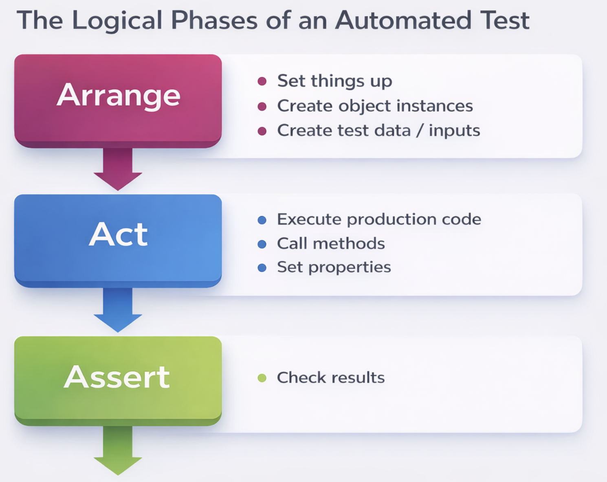

Well-structured unit tests follow a consistent pattern that makes them easy to read and maintain. This pattern is known as Arrange, Act, Assert:

- **Arrange** is the first phase where you set things up for the test:
  - You create any **object instances** needed for the test
  - You create **test data or inputs** that will be used
  - You configure **mocks or stubs** to simulate dependencies
  - The goal is to put the system in a **known state** before exercising the code

- **Act** is the second phase where you execute the production code:
  - You call the **methods being tested**
  - You set **properties** or pass **parameters**
  - This phase should typically be just **one or a few lines of code**—the actual invocation of the unit under test

- **Assert** is the third phase where you check the results:
  - You verify that the **outcome matches your expectations**
  - You check **return values**, **state changes**, or **interactions** with dependencies
  - This is where you use the **assertion methods** described earlier

This pattern, sometimes called Given-When-Then in behavior-driven development, creates tests that are self-documenting and easy to understand. Anyone reading the test can quickly see what setup was required, what action was performed, and what outcome was expected.

### Positive and Negative Test Cases

Comprehensive testing requires both positive and negative test cases to verify different aspects of behavior:

- **Positive Test Cases** focus on expected, valid scenarios:
  - They test by **valid or expected data** that the code should handle correctly
  - They check if the function does what it **should do** under normal circumstances
  - They examine the **general behaviors** of the function in expected usage scenarios
  - **Example**: Testing that a login function succeeds with correct credentials

- **Negative Test Cases** focus on error scenarios and invalid inputs:
  - They test by **invalid data** that should be rejected or handled gracefully
  - They check if the function **does not do what it should not do**—for example, that it does not accept invalid input
  - They examine if the function is **fault-proof**, meaning it does not crash or mis-respond in bad situations
  - **Example**: Testing that a login function fails with incorrect credentials and shows an error message

Both types of test cases are essential for building robust software that handles both expected and unexpected situations correctly.

### Example: Testing a File Deletion Method

Consider a method that deletes a file and returns a boolean indicating success or failure:

The Method Under Test:

- **The Method Under Test**:
  - A public method called **`boolean deleteFile(String filePath)`** that attempts to delete the specified file
  - The method returns **true** if the deletion succeeds and **false** if it fails for any reason

Positive Test Case:

- **Positive Test Case**:
  - A test method named **`deleteFile_forAbsoluteFilePath_P()`** (where "P" indicates positive)
  - The test sets up by creating a **test file** at a known location, such as "D:\Temp\file.txt"
  - It then calls the **`deleteFile`** method with that file path
  - Finally, it asserts that the file **no longer exists** on disk, verifying that deletion actually occurred

Negative Test Case:

- **Negative Test Case**:
  - A test method named **`deleteFile_forCorruptedFilePath_N()`** (where "N" indicates negative)
  - This test does **not need to create a file** because it tests behavior for non-existent or invalid paths
  - It calls the **`deleteFile`** method with a path that might be invalid or point to a non-existent file
  - It then asserts that the method returns **false** and that the program **does not crash**

### Boundary Value Analysis and Equivalence Partitioning

These are systematic techniques for selecting test cases efficiently by identifying the most important values to test:

Boundary Value Analysis focuses on the edges of input ranges:

- **Boundary Value Analysis** focuses on the **edges of input ranges**:
  - For any range of valid inputs, the **boundaries** are where errors are most likely to occur
  - You test values at the **minimum**, **just above minimum**, **just below maximum**, and **maximum**
  - You also test **invalid values** just outside the boundaries
  - **Example**: A method accepts ages from **18 to 56**:
    - **Invalid**: 17 (just below minimum)
    - **Valid**: 18 (minimum), 19 (minimum+1), 55 (maximum-1), 56 (maximum)
    - **Invalid**: 57 (just above maximum)
  - This approach catches **off-by-one errors** and boundary condition bugs efficiently

Equivalence Partitioning divides inputs into groups that should be treated the same way:

- **Equivalence Partitioning** divides inputs into groups that should be treated the same way:
  - Instead of testing every possible value, you test **one representative** from each group
  - Values in the same partition should **behave identically**, so testing one is sufficient
  - **Example** for a price validation method:
    - **Invalid low partition**: prices from **0 to 10** that are rejected
    - **Valid partition**: prices from **11 to 100** that are accepted
    - **Invalid high partition**: prices **above 100** that are rejected
  - By testing **one value from each partition** (such as 5, 50, and 150), you cover all distinct behaviors

### Test-Driven Development (TDD)

Test-Driven Development is a disciplined practice that reverses the traditional order of writing code and tests:

- **In TDD, you write failing unit tests first, then write production code until that unit test no longer fails.** This means tests are written before the code they test, not after.
- **This approach ensures that every line of production code has tests that verify its behavior.**
- **TDD is governed by three fundamental laws that must be followed strictly:**
  - **First Law:** You may not write production code until you have written a **failing unit test.** This means the very first thing you write for any new functionality is a test that fails because the functionality does not exist yet.
  - **Second Law:** You may not write more of a unit test than is sufficient to **fail**, and not compiling is failing. This keeps tests small and focused—you write just enough test to get a failure, then stop writing the test and move to production code.
  - **Third Law:** You may not write more production code than is sufficient to **pass** the currently failing test. This keeps production code minimal—you write just enough to make the test pass, no more, no less.

Following these three laws creates a rapid cycle of test-fail, code-pass, refactor that typically repeats every few minutes throughout the development day.

### The F.I.R.S.T. Principles of Clean Unit Tests

Clean unit tests follow five key principles that can be remembered with the acronym F.I.R.S.T.:

- **Fast:** Tests should be **fast.** They should run quickly, typically in milliseconds or seconds. When tests run slowly, you will not want to run them frequently. If you do not run them frequently, you will not find problems early enough to fix them easily. **Slow tests defeat the purpose of having tests.**
- **Independent:** Tests should **not depend on each other.** One test should not set up the conditions for the next test. You should be able to run each test independently and run the tests in any order you like. **Dependent tests create fragile test suites** where one failure cascades through many tests.
- **Repeatable:** Tests should be **repeatable in any environment.** You should be able to run the tests in the production environment, in the QA environment, and on your laptop while riding home on the train without a network. **Tests that depend on specific environments are unreliable** and undermine confidence in the test results.
- **Self-Validating:** The tests should have a **Boolean output.** Either they pass or they fail. You should not have to read through a log file, compare output files manually, or interpret results to tell whether the tests pass. **A test run should give a clear yes/no answer.**
- **Timely:** The tests need to be written in a **timely fashion.** Unit tests should be written just before the production code that makes them pass, following the TDD approach. **Writing tests after the code** often leads to tests that are awkward, incomplete, or never written at all.

### Keeping Tests Focused

Well-written tests are focused on a single behavior and are easy to understand:

- **One assert per test** is a guideline that suggests every test function should have **only one assert statement.** Having a single assertion means the test has a **single conclusion** that is quick and easy to understand. When a test with multiple assertions fails, you have to investigate which assertion caused the failure, slowing down diagnosis.
- **Single concept per test** means every test should test a **single concept or behavior.** The best rule is to **minimize the number of asserts per concept** and test just one concept per test function. This keeps tests small, focused, and self-documenting.

### Writing Testable Code

Not all code is easy to test. Writing testable code requires following certain design principles:

- Follow **SOLID principles**—the five object-oriented design principles that create code that is maintainable and testable.
- Write **short, simple functions** that do one thing and do it well.
- **Do not do too much work in a single function**—instead, write smaller functions for each part of the work.
- Stay away from these **problematic constructs**:
  - The **new keyword** in places that create **tight coupling.**
  - The **static keyword** which creates **global state** and hidden dependencies.
  - **Singletons** which are essentially global state in disguise.
- **Do not use global state** because it makes tests dependent on each other and hard to isolate.
- **Put no logic in constructors**—constructors should only assign parameters to fields, not perform work or call other methods.

### The Problem of Complexity

A quote from Ryan Singer captures why testable code matters:

> "So much complexity in software comes from trying to make one thing do two things."

When a single function or class tries to do multiple things, it becomes:

- **Harder to understand**
- **Harder to test** because there are multiple behaviors to verify
- **Harder to reuse** because it is too specialized
- **Harder to change** because changes affect multiple behaviors

By keeping each unit focused on a single responsibility, we reduce complexity and make testing easier.

### The Problem with the New Keyword

The new keyword creates problems for testability when used in production code:

Difficult to test code often contains hard-coded dependencies created with new:

- **The example shows a class with a writeUserName method** that directly calls `App.getDatabaseManager().getUserName()` and creates a `new FileWriter("user.txt")`.
- **This code is coupled to the application, database, and file system.**
- **To test this method, you would need a real database** with real data and a real file system.
- **The test becomes slow, non-repeatable, and dependent on external resources.**
- **You cannot isolate just this method**—you are testing the database and file system at the same time.

### Testable Code Through Dependency Injection

The solution is to inject dependencies rather than creating them inside the method:

- **The testable version of the class takes its dependencies through the constructor:** `public MyClass(final UserDatabase userDatabase)`
- **The writeUserName method now accepts a Writer parameter** instead of creating a FileWriter internally.
- **To test this class, you can easily replace UserDatabase and Writer with test doubles**—mock objects that simulate the real dependencies.
- **You can verify that the method calls the database with the correct ID** and writes the expected string to the writer.
- **Tests become fast, independent, and repeatable** because they do not depend on real databases or file systems.

### Mocks

Mocks are test doubles that help isolate the unit being tested:

- **Mocks can be used to isolate the test from the real dependencies** of the unit under test.
- **Mocked methods have empty implementations by default**, but you can configure them to behave in specific ways.
- **Mocks can be used to control the behavior of certain methods, such as:**
  - **Returning a certain result** when the method is called
  - **Calling another method** to simulate real behavior
  - **Throwing exceptions** to test error handling code
- **By using mocks, you can test how your code responds to different situations** without needing the real dependencies to be in those states.

This approach to testable code—avoiding hard-coded dependencies, injecting dependencies instead, and using mocks in tests—is fundamental to writing software that can be thoroughly tested and reliably maintained.

### The Problem with Global State, Static Keyword, and Singletons

Global state in any form creates significant problems for both code maintainability and testability:

- **Global state makes code more difficult to understand** because the user of those classes might not be aware of which variables need to be instantiated or what state must be present for the code to work correctly. When you look at a method that uses global state, **you cannot see its dependencies just by looking at its signature**—you have to know about the global variables it accesses.
- **Global state also makes tests more difficult to write** for the same reason—test authors may not know what global state needs to be set up before the test can run. Additionally, **tests can influence each other** through global state. If one test modifies global state and a later test depends on that state, the tests are no longer independent. **This violates the Independent principle of clean tests.**
- **Singletons are an example of global state** disguised as a design pattern. Despite being a class, **a singleton behaves like a global variable.** Different tests cannot use different configurations of a singleton because there is only one instance shared across all tests.
- **Static methods introduce procedural code** that is hard to change, hard to mock, and hard to test. Static methods **cannot be overridden or replaced in tests**, so if your code calls a static method, you are stuck with that implementation. There are some exceptions: simple, pure static methods such as `Math.Min()` are acceptable because their outcome is deterministic and they have no side effects. However, **you should avoid complex static methods** that interact with external resources or maintain internal state.
- **Static properties are essential global state variables** and should be avoided entirely. A static property is just a globally accessible variable that can be read and modified from anywhere in the code, creating all the problems of global state.

### Example of Problematic Global State

Consider this code example that uses global state:

```csharp
public class SomeClass
{
    public void Do()
    {
        var mySetting = ConfigurationManager.AppSettings["MySetting"]
    }
}
```

This code has several testability problems:

- **The `ConfigurationManager` is a static class**, making it **global state**
- **The `AppSettings` property is static**, accessing configuration values from somewhere outside the class
- **When testing `Do()`**, you have **no way to control** what configuration value is returned
- **You would need to actually modify the application configuration file** to change the test behavior
- **Different tests cannot run with different configuration values** without modifying the same global configuration
- **Tests become dependent on the environment** and on each other's configuration changes

### Improved Version with Dependency Injection

A better approach is to inject dependencies explicitly:

```csharp
public class SomeClass
{
    private Settings _settings;

    public SomeClass(Settings setting)
    {
        _settings = setting;
    }

    public void Do()
    {
        var mySetting = settings.MySetting;
    }
}
```

This version solves the testability problems:

- **The dependency on settings is now explicit in the constructor**
- **When testing**, you can create a `Settings` object with whatever values you need for that specific test
- **Different tests can use different settings objects** without interfering with each other
- **The class no longer depends on global state**—all its dependencies are passed in
- **You can easily create mock or fake settings objects** to test different scenarios

### Logic in Constructors

Placing logic in constructors is a well-known anti-pattern that causes significant testing problems:

- **Logic in a constructor should be avoided** because constructors should be simple and reliable
- **Tests depend on creating the class's objects**, and if there is complex logic in the constructor, that logic runs every time you create an instance for testing
- **A bug or misconfiguration in the constructor can cause all tests to fail** because every test needs to create the object
- **Different tests may require different ways to create an object**, but constructors force the same creation logic for all uses
- **Generally, you want to create the object in the same way for all tests**, but constructor logic might make assumptions that are not valid for all test scenarios

The fix is to create factory classes—separate classes responsible for initializing your objects. Factory classes give you control over how objects are created and allow different creation strategies for different situations. They also isolate the complexity of object creation so it does not pollute the constructors of your main classes.

For example, instead of:

```csharp
public class ReportGenerator
{
    private DatabaseConnection _connection;

    public ReportGenerator()
    {
        // Logic here that connects to a database, reads configuration, etc.
        _connection = new DatabaseConnection("server=...");
        _connection.Connect();
    }
}
```

You would write:

```csharp
public class ReportGenerator
{
    private DatabaseConnection _connection;

    public ReportGenerator(DatabaseConnection connection)
    {
        _connection = connection;
    }
}

public class ReportGeneratorFactory
{
    public ReportGenerator CreateForProduction()
    {
        var connection = new DatabaseConnection("server=...");
        connection.Connect();
        return new ReportGenerator(connection);
    }

    public ReportGenerator CreateForTesting()
    {
        var connection = new MockDatabaseConnection(); // test double
        return new ReportGenerator(connection);
    }
}
```

- **This separation makes testing straightforward** while keeping the main class simple and focused on its core responsibility.

### Validation and Verification Activities

This slide serves as a title introducing the topic of validation and verification in software development. Validation asks the question "are we building the right product?" while verification asks "are we building the product right?" Acceptance testing is a key validation activity that ensures the software meets customer expectations.

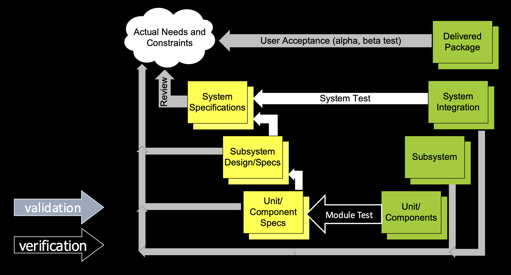

### Acceptance Tests

Acceptance tests are a critical bridge between customer requirements and technical implementation:

- **Acceptance tests are defined by the customer** rather than by developers or testers alone. This ensures that the tests reflect what the customer actually wants, not what the developers think the customer wants.
- **The purpose is to ensure the correctness and completeness of stories**—to verify that each user story has been implemented according to the customer's expectations.

Acceptance tests provide multiple benefits:

- **Increase confidence that the system does what it is supposed to do.** When acceptance tests pass, both the team and the customer can be confident that the functionality is correct.
- **Facilitate concrete definition of stories** because writing tests forces the customer to think through specific scenarios and outcomes, making abstract requirements concrete.
- **Provide automated regression testing** so that when changes are made later, the team can quickly verify that existing functionality still works.
- **Improve customer–developer communication** because discussing test scenarios gives both sides a concrete way to discuss requirements and resolve ambiguities.

### Obstacles to Acceptance Testing

Despite their value, acceptance tests face several common obstacles:

- **Lack of customer involvement is the most significant obstacle.** If the customer is not available to define and review acceptance tests, the tests either do not get written or are written by developers who may not fully understand the business needs.
- **Lack of a common framework** means there is no shared way to write and run acceptance tests. Without a standard approach, tests become inconsistent and difficult to maintain.
- **Additional effort for defining more tests can be seen as a burden.** Teams already under pressure may resist spending time on acceptance testing, even though it saves time later by catching problems early.

### Scope of Acceptance Tests

Acceptance tests focus on certain aspects of the system while leaving other aspects to different types of testing:

- **What is included in acceptance tests:**
  - **Interaction and Flow**—how users interact with the system and move through workflows
  - **Performance**—whether the system meets speed and responsiveness requirements
  - **Error Handling**—how the system behaves when things go wrong
  - **Security**—whether the system properly controls access and protects data
- **What is excluded from acceptance tests:**
  - **Usability**—whether the interface is easy to use (this requires user testing, not automated tests)
  - **Look and Feel**—visual design, colors, layout (these are subjective and better evaluated through review)
  - **Unit Testing**—testing individual methods or classes (this is the developers' responsibility)

### Acceptance Tests vs. Unit Tests

| Aspect            | Acceptance Tests                                           | Unit Tests                              |
| ----------------- | ---------------------------------------------------------- | --------------------------------------- |
| Definition Source | Defined by the customer using a formal but simple language | Defined by developers                   |
| Technical Level   | Written in a way that non-technical people can understand  | Written in programming languages        |
| Who Writes Them   | Customers describe scenarios, they do not write code       | Developers write code                   |
| Tools Used        | Excel, Wiki pages, or similar non-technical tools          | IDEs and testing frameworks             |
| Focus             | User interaction and complete features                     | Single units such as methods or classes |
| Scope             | Tests multiple parts of the system working together        | Tests isolated components               |
| Perspective       | User’s perspective                                         | Developer’s perspective                 |

### Techniques and Tools for Acceptance Testing

Several approaches and tools support acceptance testing:

- **The basic approach is to specify requirements** in the form of semi-formal scenario descriptions that capture how the system should behave in specific situations.
- **A more advanced example approach is Behavior-Driven Development (BDD)**, which provides a structured way to define and automate acceptance criteria.
- **Various example tools exist to support these approaches**, though the specific tools are not listed on this slide.

### BDD Overview

Behavior-Driven Development is a methodology that extends TDD with a focus on business value:

- **User stories are defined as scenarios** that describe specific examples of system behavior.
- **Scenarios describe acceptance criteria** in a way that both business stakeholders and developers can understand.
- **Scenarios are converted to automated tests** that verify the system meets the acceptance criteria.

### User Story

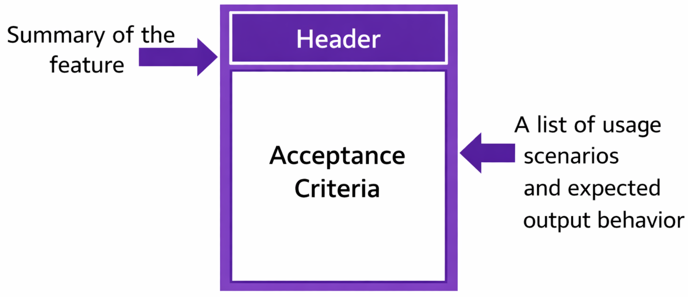

### Automated Testing with BDD Tools

BDD scenarios can be automated using specialized tools:

- **The process involves converting usage scenarios** to executable test cases that can be run automatically.
- **Two prominent tools are mentioned as examples:**
  - **FitNesse**—a wiki-based tool that allows tests to be written in tables and executed against the system
  - **Selenium**—a tool for automating web browser interactions, useful for testing web applications from the user interface level

These tools bridge the gap between human-readable scenarios and automated verification.

### Selenium

- **Selenium automates web browsers**, allowing tests to interact with web applications just as a user would
- **It can click links, fill forms, and verify page content programmatically**
- **Selenium tests can be written in multiple programming languages** including Java, C#, Python, and Ruby
- **It integrates with testing frameworks like JUnit** and with BDD tools like Cucumber
- **Selenium is particularly valuable for acceptance testing** because it tests the actual user interface, verifying that the system works from end to end

## Minimum Viable Product (MVP) and Lean Startup

### Introduction to Minimum Viable Product

The Minimum Viable Product, or MVP, is a core concept in modern product development that focuses on delivering value with minimal effort:

- **The MVP represents the minimum product features that can be bought** or, in other words, the minimal set of functionality that can get the early adopters on board and help you attain feedback from them to build the finished product
- **This approach recognizes that you do not need to build the complete product** to start learning from real users

Defining the Minimum Viable Product

Wikipedia provides a formal definition:

> "In product development, the Minimum Viable Product (MVP) is a product with just enough features to gather validated learning about the product and its continued development."

This definition emphasizes that the purpose of an MVP is not to generate revenue or achieve market dominance, but to learn—specifically, to gather validated learning that informs future development decisions.

#### How to approach building an MVP involves five key considerations:

- **Scale your idea** by identifying the core, powerful, and cost-effective features that are essential to deliver value
- **Define your target audience** by creating a potential buyer profile—understand who will use your product first
- **Identify the top 3 features** that matter most to those early adopters and deliver those first
- **Consider the cost of releasing** and minimize the cost of the initial product with respect to the tight budget you typically have at the start
- **Apply regional knowledge** by incorporating specific value-added elements for your target market that differentiate your product

### Eric Ries on MVP

Eric Ries, who pioneered the Lean Startup movement, offers another perspective:

> "MVP actually is that version of a new product which allows a team to collect the maximum amount of validated learning with the least effort."

This definition highlights the efficiency aspect—you want the most learning possible for the least effort invested. The MVP is not about building a cheap product; it is about building a learning vehicle efficiently.

#### Why do we desire an MVP? There are four primary reasons:

- **Validate your idea**—an MVP is open for further development, like taking baby steps. You test whether you are heading in the right direction before committing significant resources
- **Obtain initial seed funding**—having a working product, even a minimal one, gives you something to show investors and provides resources to build the next version
- **Understand your target audience**—the feedback from MVP users helps you make a go or no-go decision for the next version. You learn whether you should continue or abandon the idea
- **Discover demand for features**—real users tell you what to do next by showing you what they actually use and what they ask for

### The MVP Design Process

Building an MVP follows a process designed to maximize learning while minimizing waste:

- **You can test your understanding** of whether the product is needed without having to use a huge number of resources to develop the full product. This prevents the common mistake of building something nobody wants
- **You can accelerate the team's learning** regarding what the customer wants and needs whilst using rapid iteration to deliver that. Each cycle of feedback and improvement builds understanding
- **You can minimize the number of wasted hours** spent by your development team by focusing on a minimal number of features for launch. Every feature not built is time not wasted

**The advantages of this approach are significant:**

- **You can go to market faster** and thus, theoretically, start to raise sales revenues sooner than if you develop the fully featured final product for launch. Speed to market matters
- **You can gain a competitive advantage** if other companies are contemplating entering the market you are focusing on. Being first, even with less functionality, can establish mindshare and user loyalty

### Why Startups Fail

Understanding why startups fail is essential to appreciating why concepts like Minimum Viable Product are so valuable. An analysis of startup post-mortems reveals the most common reasons new ventures fail:

- **No Market Need**—This is the most common reason by far. Startups build something that nobody actually wants or needs. This is precisely the problem that an MVP is designed to solve—by releasing a minimal product early, you test whether there is genuine demand before investing heavily in development.
- **Ran Out of Cash**—Startups exhaust their funding before achieving sustainability. An MVP approach conserves resources by focusing only on essential features, extending the runway and allowing more time to find product-market fit.
- **Not the Right Team**—The team lacks the right skills, experience, or cohesion to execute. While an MVP cannot fix team problems, the rapid feedback cycles of Lean Startup can help identify capability gaps early.
- **Get Outcompeted**—Another company wins the market, either by getting there first or by building a better solution. Moving quickly with an MVP can help you establish a market presence before competitors.
- **Pricing or Cost Issues**—The product costs too much to build or cannot be sold at a price customers will pay. Early feedback from MVP users helps validate pricing assumptions before committing to a full-scale launch.
- **Poor Product**—The product itself is badly designed, buggy, or unpleasant to use. Iterative development based on user feedback—central to the MVP philosophy—helps refine the product continuously.
- **Lack of Business Model**—The startup cannot figure out how to make money. An MVP allows experimentation with different business models at low cost.
- **Poor Marketing**—The startup builds something good but cannot reach customers. Early adopters attracted by an MVP can become evangelists and provide marketing insights.
- **Ignore Customers**—The team builds what they think customers want rather than listening to actual feedback. The Build-Measure-Learn loop of Lean Startup forces customer listening.
- **Product Mis-Timed**—The product is too early or too late for the market. An MVP approach reduces the risk of mistiming by getting something into the market quickly and adapting based on response.

The critical insight from this analysis is that many of these failures could be avoided if an MVP approach had been used. By releasing a minimal product early, gathering real feedback, and iterating based on learning, startups can test assumptions, conserve resources, and adapt before it is too late. The MVP is not just a product strategy—it is a risk management tool for the entire venture.

### Lean Startup

Lean Startup is a methodology that extends MVP concepts to the entire business development process:

> "Lean startup is a methodology for developing businesses and products, which aims to shorten product development cycles by adopting a combination of business-hypothesis-driven experimentation, iterative product releases, and validated learning." — Wikipedia

The philosophy can be summarized as KISS: Keep It Simple, Stupid—avoid unnecessary complexity in both product and process.

**The core principles of Lean Startup include:**

- **MVP**—starting with a minimum viable product to begin learning immediately
- **Continuous Deployment**—releasing updates frequently to get constant feedback
- **Split Testing (A/B Testing)**—comparing different versions to see which performs better
- **Actionable Metrics**—measuring what matters, such as key performance indicators, page views, new users each day, and other metrics that inform decisions
- **Pivot**—making a structured course correction when the current approach is not working
- **Innovation Accounting**—measuring progress in a way that reflects the unique challenges of innovation
- **Build-Measure-Learn**—the core feedback loop that drives all development: build something, measure how it performs, learn from the results, and repeat

### Brief Summary

The key takeaways about MVP and Lean Startup can be summarized as follows:

- **Keeping MVP design in mind will save you a lot**, especially when the product is immature and market reaction is unknown. The risk of building something nobody wants is highest in these situations, and MVP mitigates that risk
- **Lean is a business development methodology** that aims to shorten product development cycles through disciplined experimentation and learning
- **The Lean development process incorporates the aspects** that should be considered to develop faster and be more productive within restricted resources, making it particularly valuable for startups and new product initiatives where resources are limited
