# SEC509 — Final Exam Cheatsheets

This folder contains a 14-page set of handwritten study notes prepared for final exam revision in SEC509. The notes are provided as scanned images and summarize key concepts and practical guidance across several topics relevant to web and application security.

Topics covered
- OWASP Top 10: an overview of common web application risks and mitigation strategies.
- OWASP API Security Top 10: API-specific threats and recommended protections.
- Honeypots: design, deployment types, detection and monitoring strategies.
- PHP vulnerabilities: common issues in PHP applications and secure coding practices.
- C vulnerabilities: memory-safety problems (buffer overflows, NULL dereferences, integer overflows), exploitation vectors and defenses.
- Resilient Applications: defense-in-depth, secure defaults, logging/alerting, and hardening guidance for building robust apps.

How to use
- Open and read the scanned pages in this directory for quick revision and reference.
- Print the pages or zoom in for easier reading.
- If you would like, I can convert these handwritten notes into typed summaries, translations, or structured study cards — ask and I will prepare them.

Notes
- These are personal study notes intended to help prepare for the final exam. They are not an official course document.

## Scanned Cheatsheets

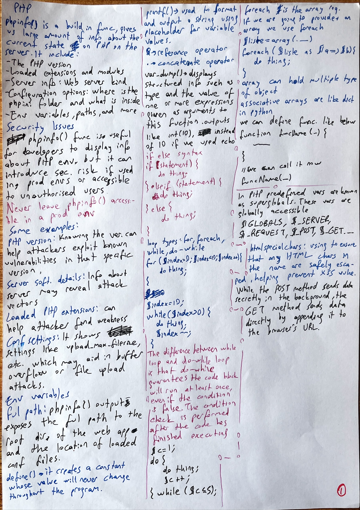
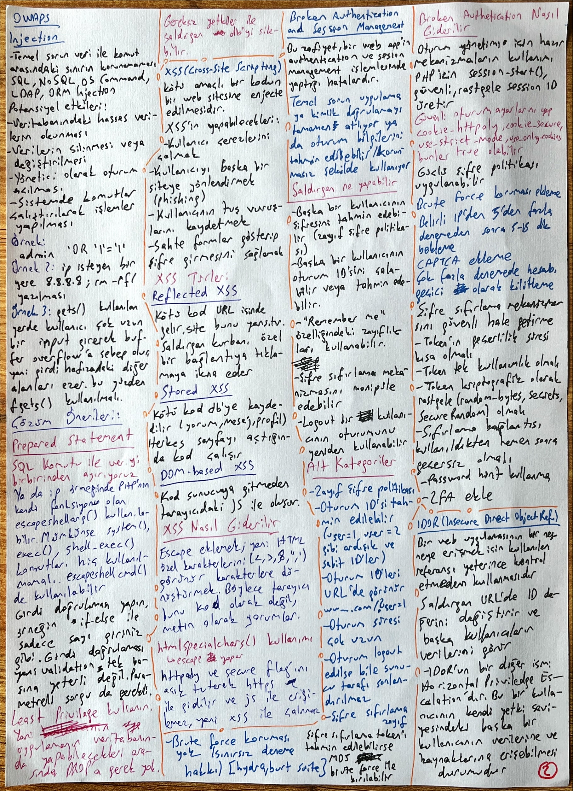
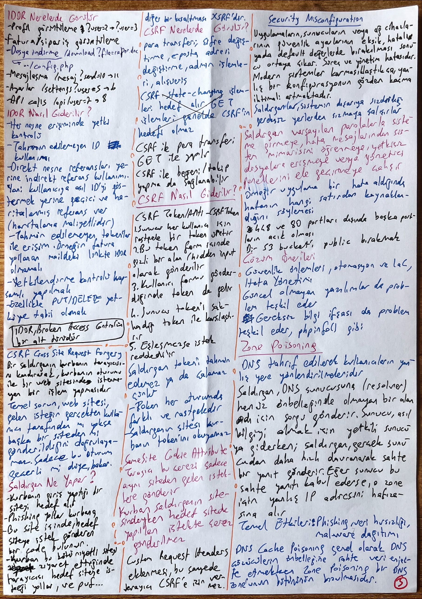
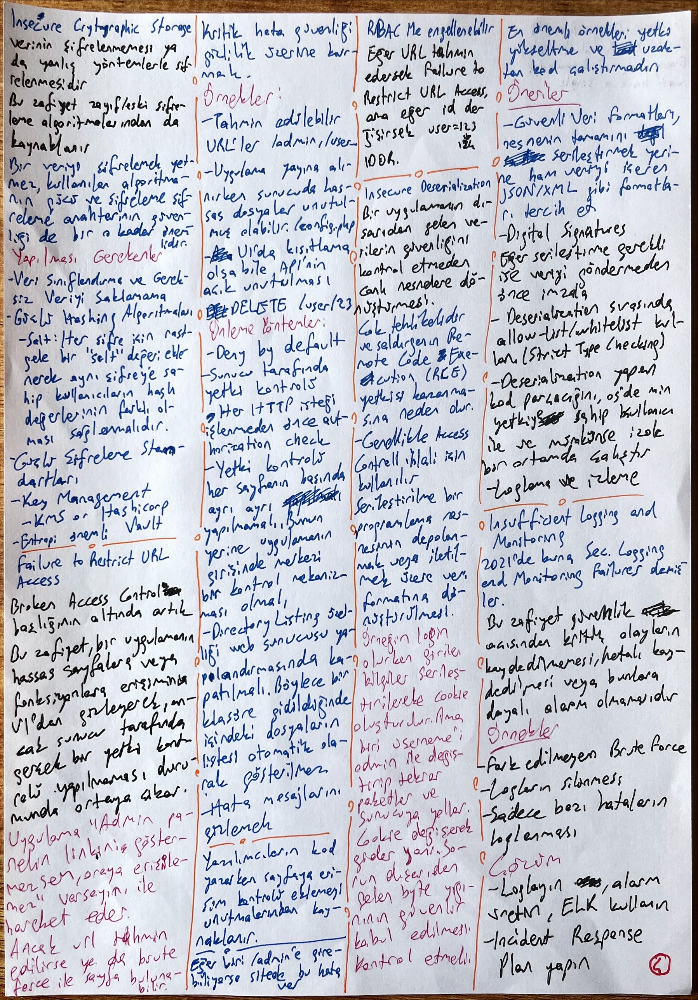
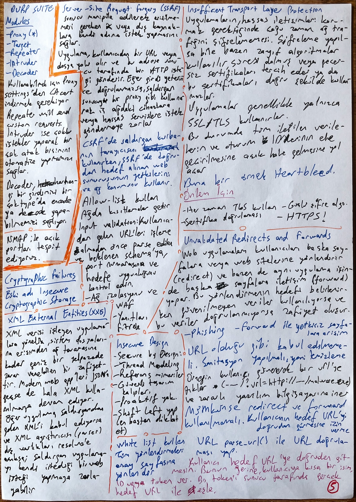
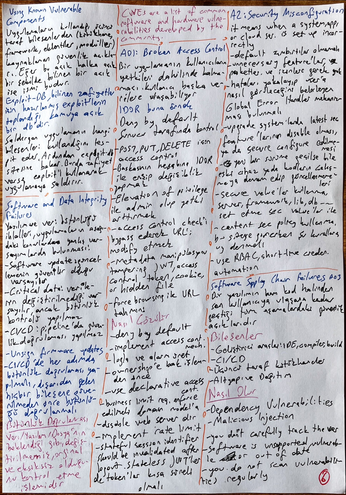
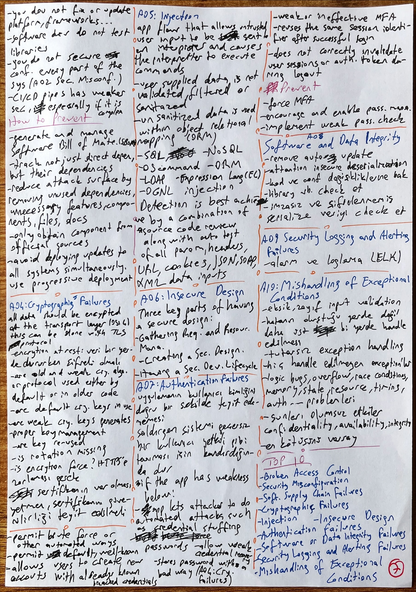
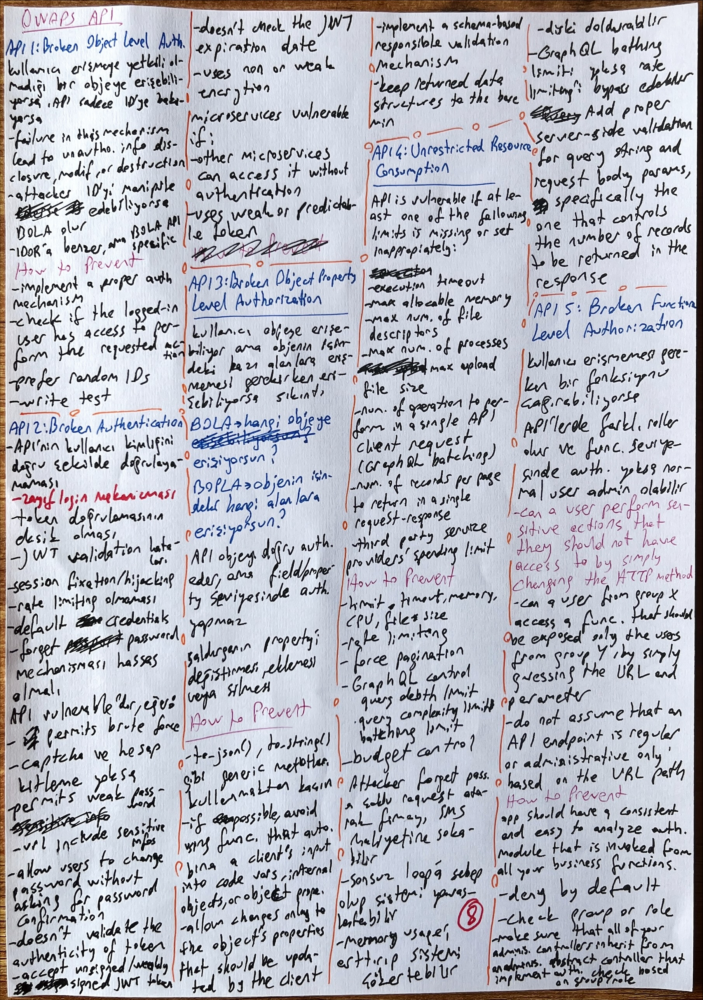
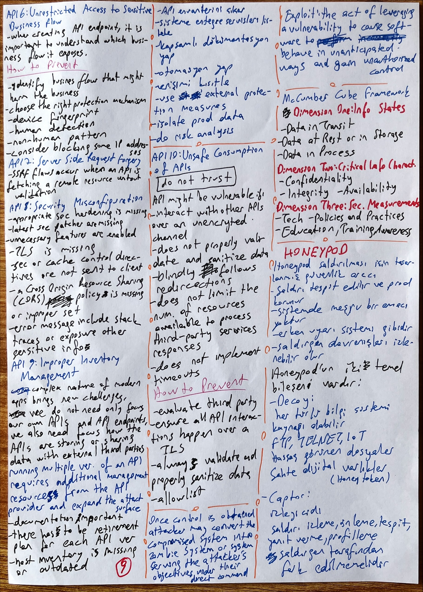
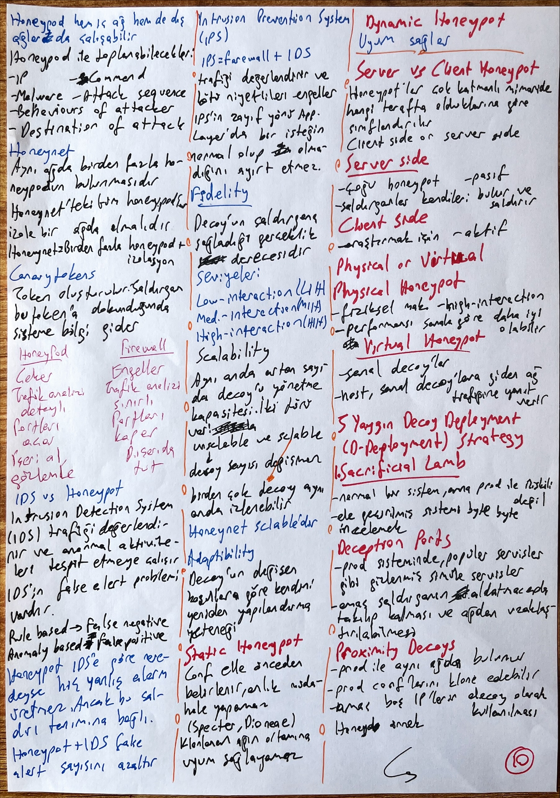
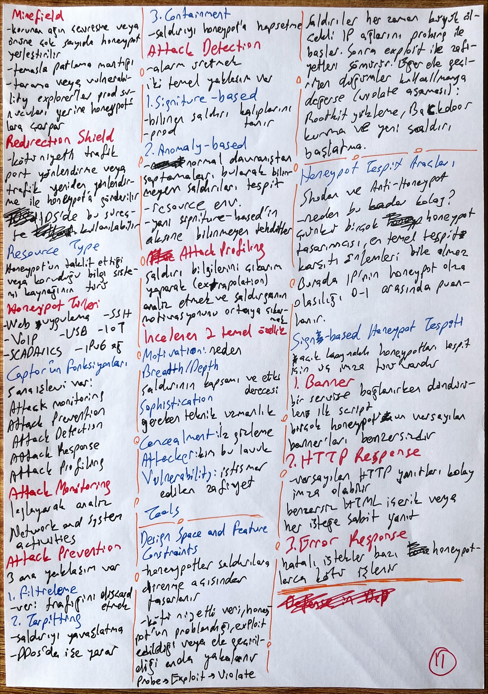
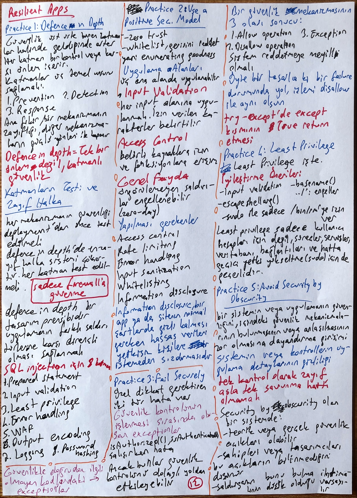
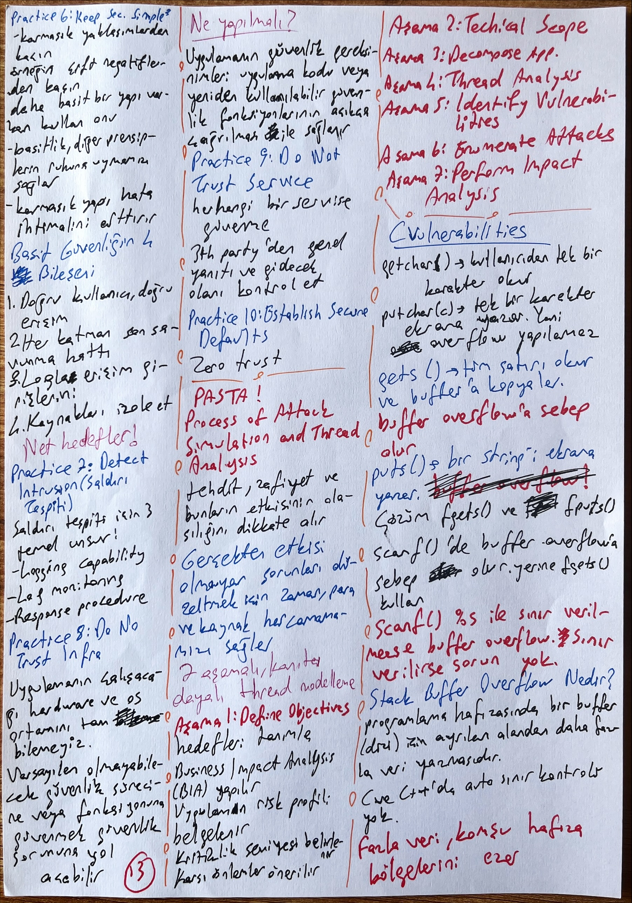
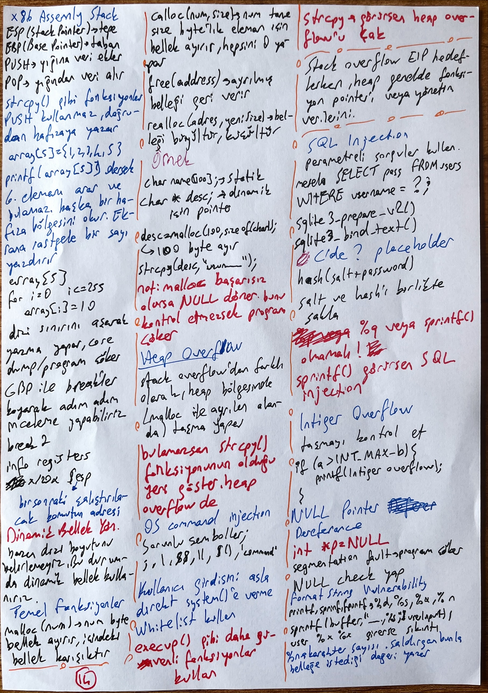
